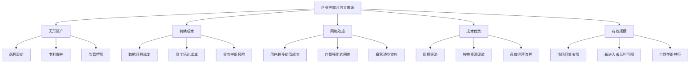
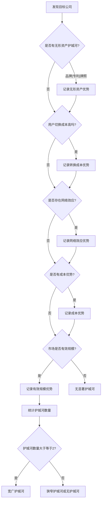
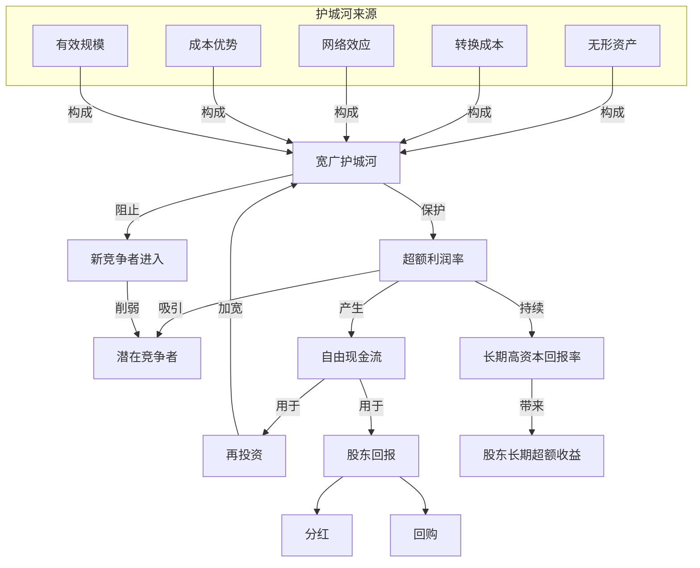
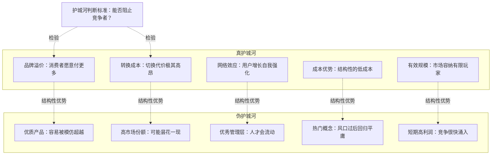

# 知识图谱图片描述 - 《巴菲特的护城河》

---

## 图一：五种护城河来源树状图

**用途**：系统展示企业护城河的五种主要来源及其特征

**Mermaid 代码**：

**布局说明**：根节点居中顶部，五大护城河均匀展开，每个来源下三个具体表现形式。

---

## 图二：护城河评估决策路径图

**用途**：展示评估一家公司护城河宽度的分析决策流程

**Mermaid 代码**：

**布局说明**：自上而下的评估流程，逐一检验五种护城河，最终汇总判断宽度。

---

## 图三：护城河与企业回报关系网络图

**用途**：展示护城河、竞争、利润和长期回报之间的因果网络

**Mermaid 代码**：

**布局说明**：展示护城河保护利润、利润再投资加宽护城河的正向循环网络。

---

## 图四：真护城河与伪护城河对比图

**用途**：对比真正的护城河与常见伪护城河的本质差异

**Mermaid 代码**：

**布局说明**：左右对比结构，真护城河具有结构性特征，伪护城河多为暂时性现象。
