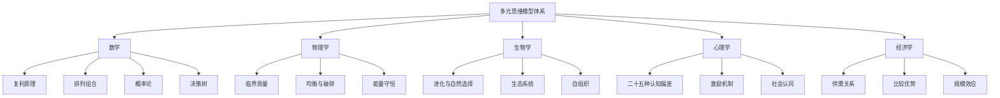
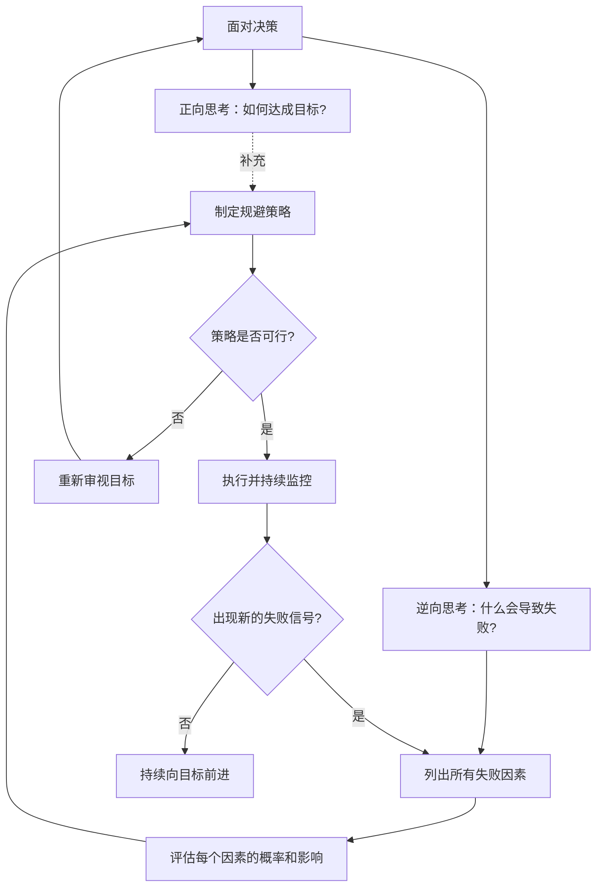
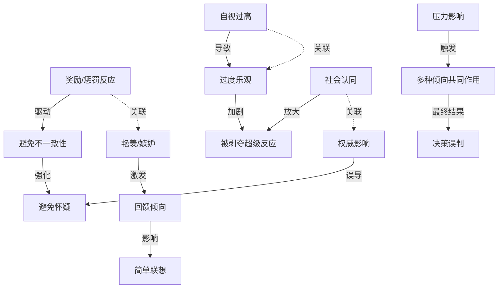
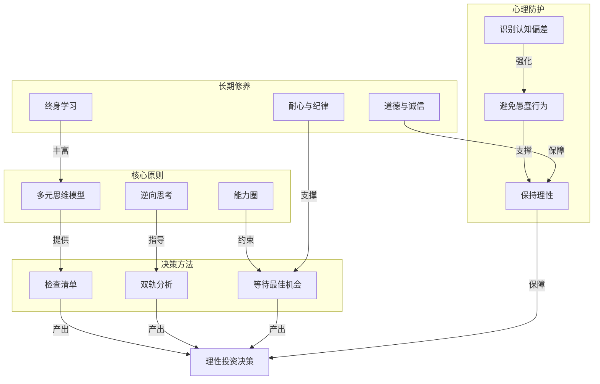

# 知识图谱图片描述 - 《穷查理宝典》

---

## 图一：多元思维模型树状图

**用途**：展示芒格多元思维模型的跨学科体系结构

**Mermaid 代码**：

**布局说明**：根节点居中顶部，五大学科分支展开，每学科三到四个核心模型。

---

## 图二：逆向思考决策路径图

**用途**：展示运用逆向思考进行决策的完整流程

**Mermaid 代码**：

**布局说明**：双路径并行后汇聚，逆向思考为主线，正向思考为补充。

---

## 图三：误判心理学网络图

**用途**：展示主要认知偏差之间的关联关系和叠加效应

**Mermaid 代码**：

**布局说明**：展示认知偏差的触发链路和叠加效应，最终汇聚到决策误判。

---

## 图四：芒格投资哲学全景图

**用途**：展示芒格投资哲学各要素之间的关系

**Mermaid 代码**：

**布局说明**：四个层面递进关系，从核心原则到决策方法到心理防护到长期修养，最终汇聚到理性投资决策。
