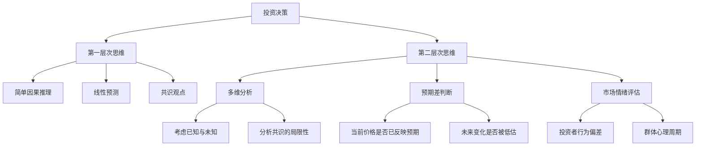
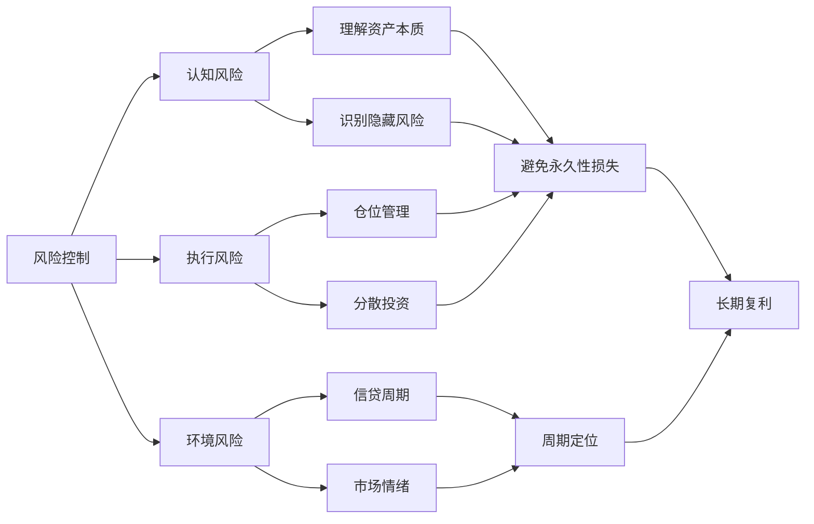
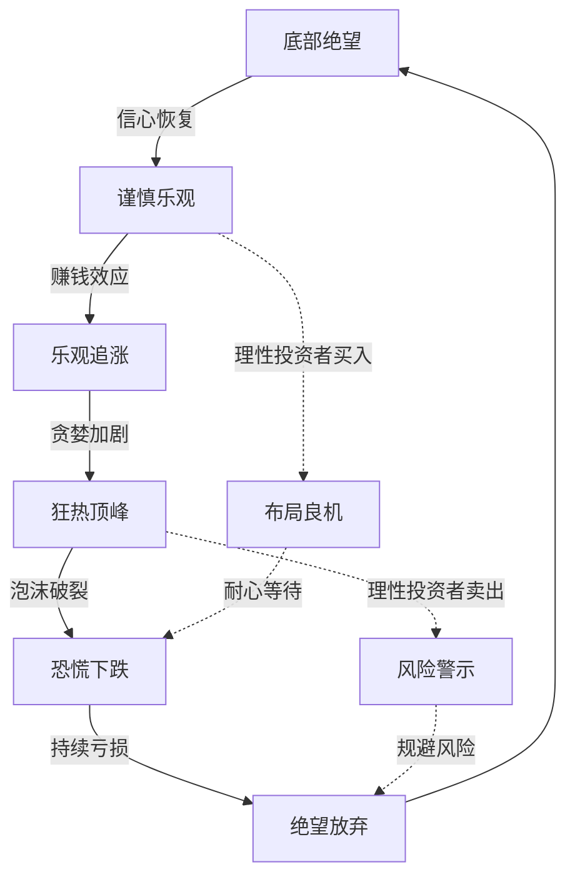
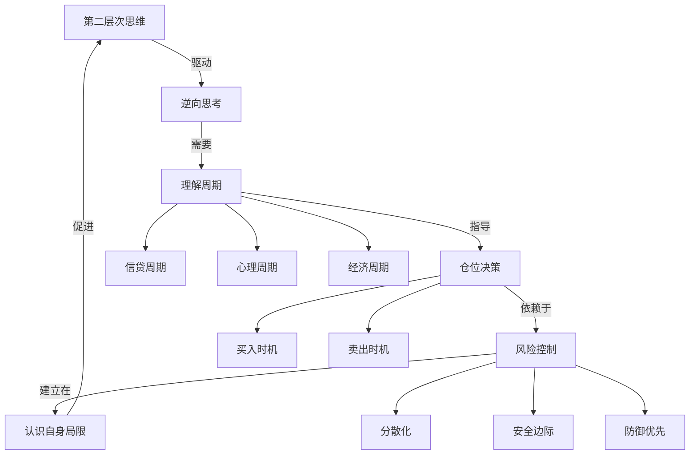

# 《投资最重要的事》知识图谱图片描述

本文档包含四个Mermaid图，用于描述《投资最重要的事》的核心知识体系。

---

## 图一：投资决策思维树

描述投资思维从第一层次到第二层次的递进关系，以及每个层次的关键判断要素。

---

## 图二：风险控制网络

描述马克斯风险管理体系中各要素之间的关联和相互作用。

---

## 图三：市场周期路径

描述投资者心理和市场走势的周期性变化路径。

---

## 图四：投资核心要素关系图

描述《投资最重要的事》中各个核心理念之间的因果关系。

