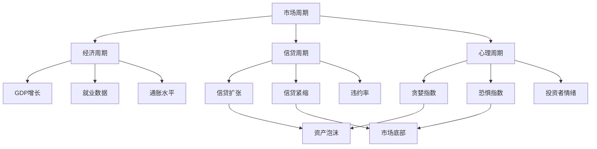
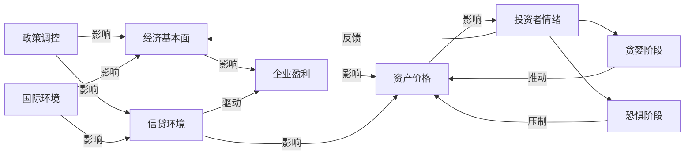
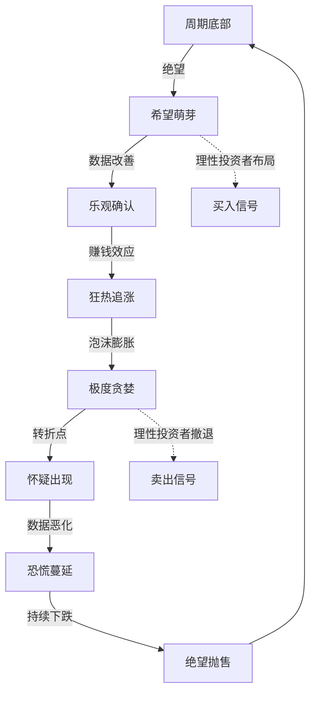
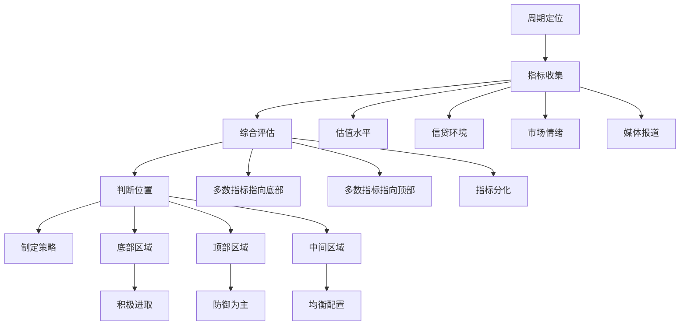

# 《周期》知识图谱图片描述

本文档包含四个Mermaid图，用于描述《周期》的核心知识体系。

---

## 图一：周期类型树

描述市场中存在的各种周期类型及其层级关系。

---

## 图二：周期关联网络

描述不同周期之间的相互影响和传导机制。

---

## 图三：市场周期路径

描述市场从底部到顶部再到底部的完整周期路径。

---

## 图四：周期定位决策模型

描述如何根据自身在周期中的位置制定投资策略。

