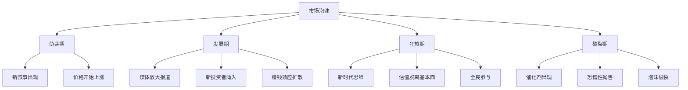
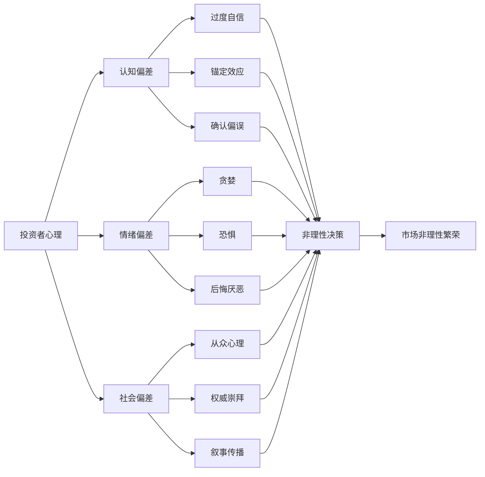
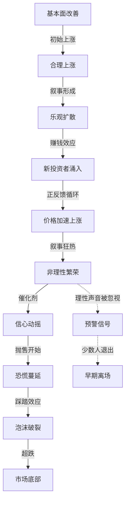
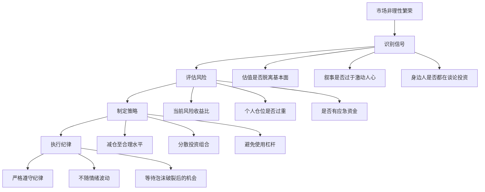

# 《非理性繁荣》知识图谱图片描述

本文档包含四个Mermaid图，用于描述《非理性繁荣》的核心知识体系。

---

## 图一：泡沫形成树

描述市场泡沫从萌芽到破裂的各个阶段及其驱动因素。

---

## 图二：行为偏差网络

描述影响投资者决策的主要心理偏差及其相互作用。

---

## 图三：泡沫生命周期路径

描述市场泡沫从产生到破裂的完整路径，以及各阶段的典型特征。

---

## 图四：理性投资防御模型

描述如何在非理性繁荣中保持理性并制定防御策略。

