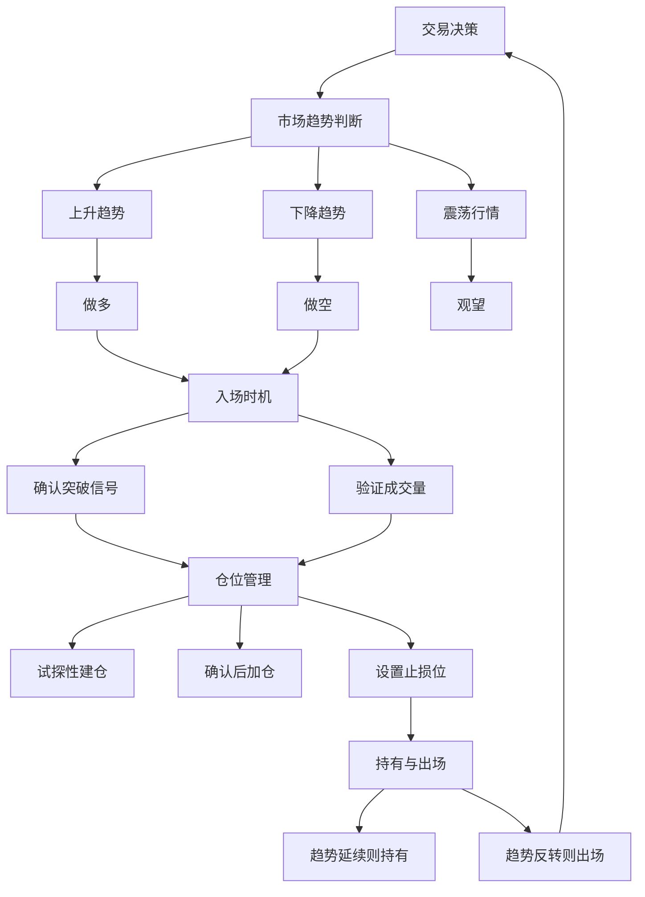
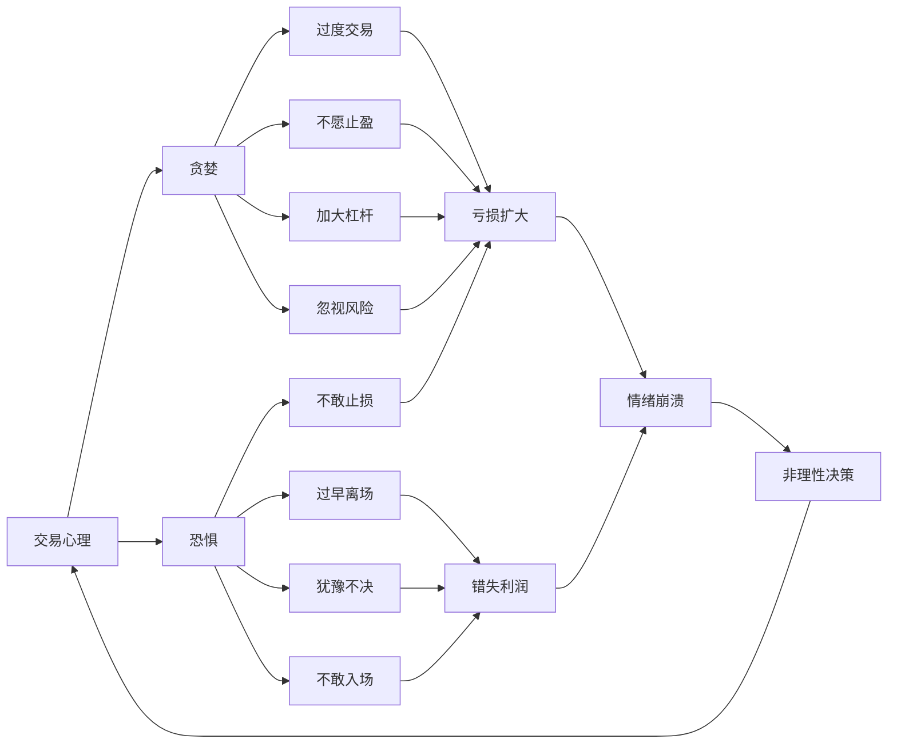
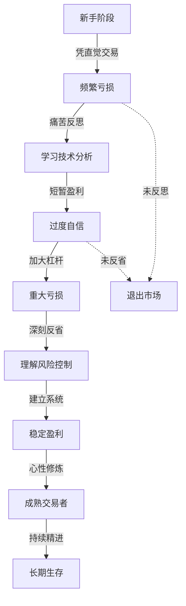
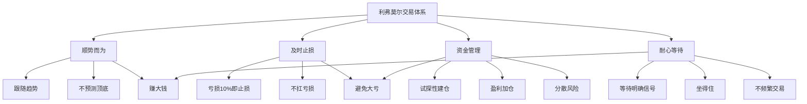

# 《股票大作手回忆录》知识图谱图片描述

本文档包含四个Mermaid图，用于描述《股票大作手回忆录》的核心知识体系。

---

## 图一：交易决策树

描述利弗莫尔交易决策的核心逻辑和判断路径。

---

## 图二：交易心理网络

描述交易中贪婪与恐惧的表现形式及其相互关系。

---

## 图三：交易成长路径

描述交易者从新手到成熟的心路历程和关键转折点。

---

## 图四：利弗莫尔交易原则体系

描述利弗莫尔交易体系的核心原则及其关联关系。

