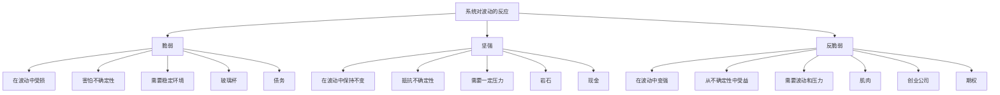
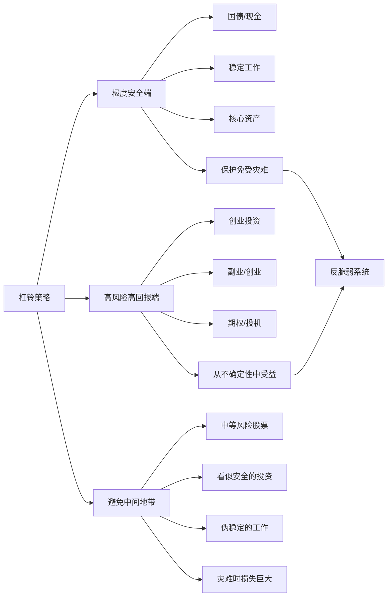
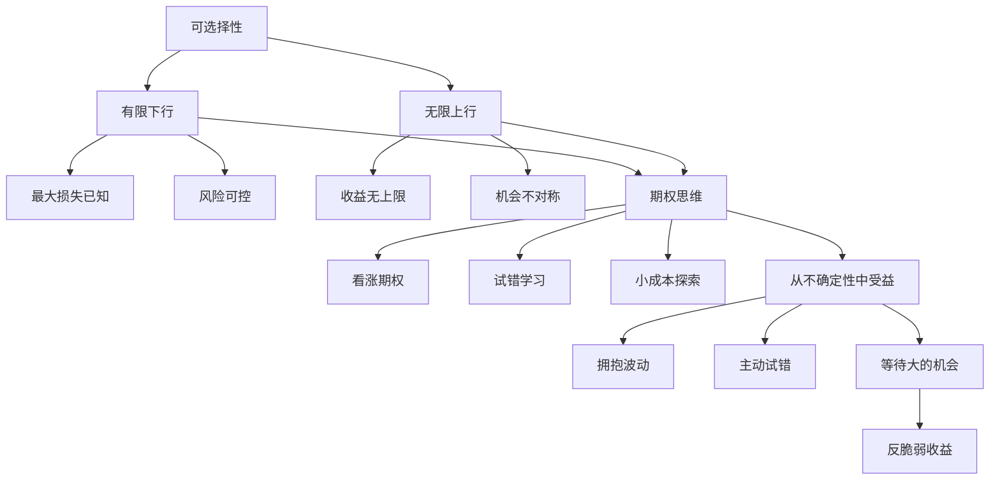
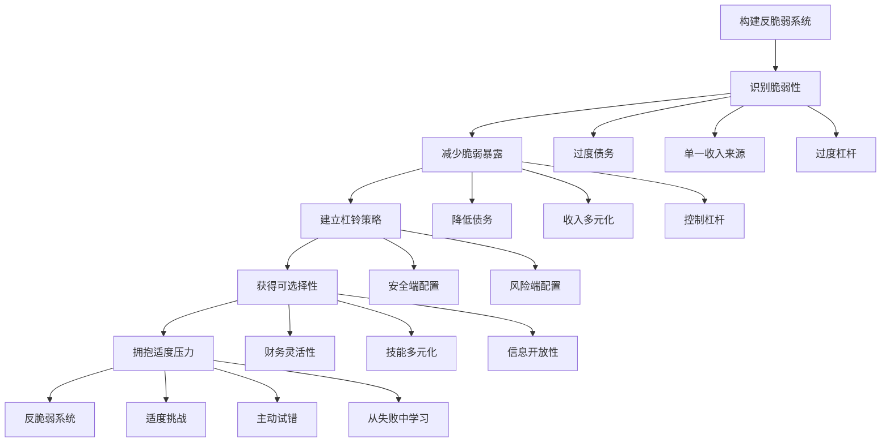

# 《反脆弱》知识图谱图片描述

本文档包含四个Mermaid图，用于描述《反脆弱》的核心知识体系。

---

## 图一：脆弱性光谱树

描述从脆弱到反脆弱的三种状态及其特征和代表事物。

---

## 图二：杠铃策略网络

描述杠铃策略在不同领域的应用及其核心逻辑。

---

## 图三：可选择性路径

描述如何通过可选择性在不确定的环境中获得优势。

---

## 图四：反脆弱系统构建模型

描述如何构建一个反脆弱的个人或投资系统。

