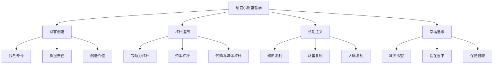
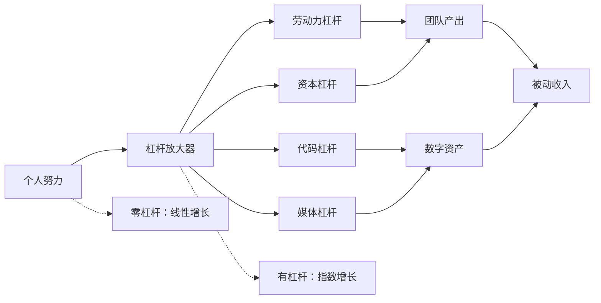
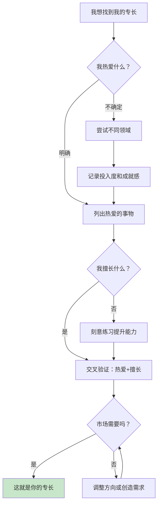

# 《纳瓦尔宝典》知识图谱图片描述

本文档包含四个知识图谱的 Mermaid 代码及详细描述，用于生成公众号配图。

---

## 图一：纳瓦尔财富哲学体系树（Tree Diagram）

### Mermaid 代码

### 设计说明

- 采用自上而下的树状结构，根节点为"纳瓦尔财富哲学"
- 四个主分支分别对应财富、杠杆、长期主义、幸福
- 每个主分支下有三个子节点，形成对称的树形结构
- 配色建议：根节点用深色，主分支用渐变色，子节点用浅色

---

## 图二：杠杆效应关系网络图（Network Diagram）

### 设计说明

- 以"杠杆放大器"为中心节点，展示四种杠杆类型及其产出路径
- 实线箭头表示直接的因果关系，虚线表示对比关系
- 突出"零杠杆"与"有杠杆"的增长差异
- 适合用不同颜色区分三种产出层级

---

## 图三：复利增长路径图（Path Diagram）

### 设计说明

- 水平路径图，从左到右展示时间轴上的复利增长过程
- 颜色由浅到深，象征能量的逐步积累和爆发
- 每个节点标注时间节点和阶段特征
- 可在图下方添加一条对应的曲线示意复利增长曲线

---

## 图四：专长发现决策图（Graph Diagram）

### 设计说明

- 采用决策流程图形式，帮助读者一步步找到自己的专长
- 菱形节点表示判断条件，矩形节点表示行动步骤
- 最终目标节点用绿色高亮标注
- 形成闭环结构，体现"尝试-验证-调整"的循环过程

---

## 使用建议

1. 四个图谱分别对应体系概览、杠杆原理、复利路径、专长发现四个核心主题
2. 建议每张图使用统一的配色方案，保持公众号视觉风格一致
3. Mermaid 图可使用在线渲染工具转换为 PNG 图片后插入公众号文章
4. 图三和图四建议在渲染后添加适当的文字标注以增强可读性
