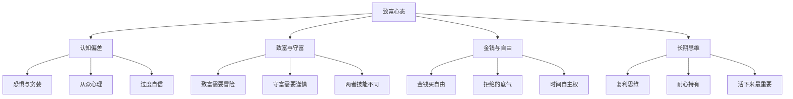
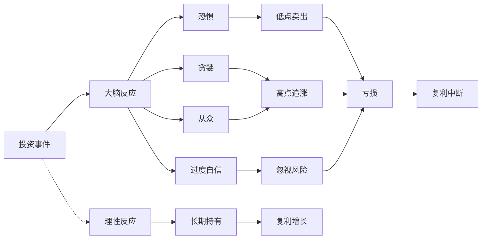
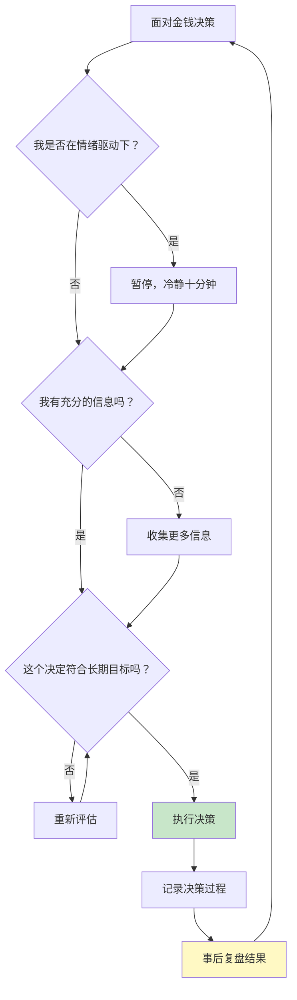

# 《致富心态》知识图谱图片描述

本文档包含四个知识图谱的 Mermaid 代码及详细描述，用于生成公众号配图。

---

## 图一：致富心态框架树（Tree Diagram）

### Mermaid 代码

### 设计说明

- 自上而下的树状结构，根节点为"致富心态"
- 四个主分支：认知偏差、致富与守富、金钱与自由、长期思维
- 每个分支三个子节点，对称分布
- 配色建议：根节点深蓝色，主分支用蓝绿色渐变，子节点用浅色调

---

## 图二：行为偏差影响网络图（Network Diagram）

### 设计说明

- 以"大脑反应"为关键节点，展示四种行为偏差如何导致非理性决策
- 上方路径为非理性决策链，下方虚线路径为理性决策链
- 通过对比突出理性决策的优势
- 建议使用红色标注非理性路径，绿色标注理性路径

---

## 图三：财富积累路径图（Path Diagram）

### 设计说明

- 水平路径图，展示从存钱到财务自由的完整过程
- 颜色由浅到深，象征财富积累的深度递进
- 关键转折点"经历第一次亏损"用特殊标记
- 建议在图下方添加一条对应的财富增长曲线

---

## 图四：理性决策流程图（Graph Diagram）

### 设计说明

- 采用决策流程图形式，帮助读者建立理性决策框架
- 包含"暂停-冷静-评估-执行-复盘"的完整循环
- 执行节点用绿色高亮，复盘节点用黄色标注
- 形成闭环，体现持续改进的循环过程

---

## 使用建议

1. 四个图谱分别对应：心态框架、行为偏差分析、财富积累路径、理性决策流程
2. 建议全系列使用统一的紫蓝色调配色方案
3. 图三的路径图适合搭配实际案例说明每个阶段的特点
4. 图四的决策流程可以作为读者日常使用的实用工具图
5. 渲染后的图片建议添加适当的文字说明增强可读性
