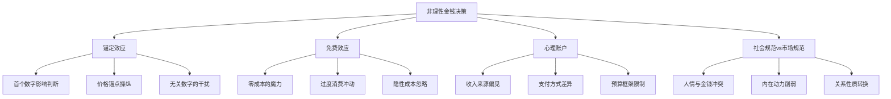
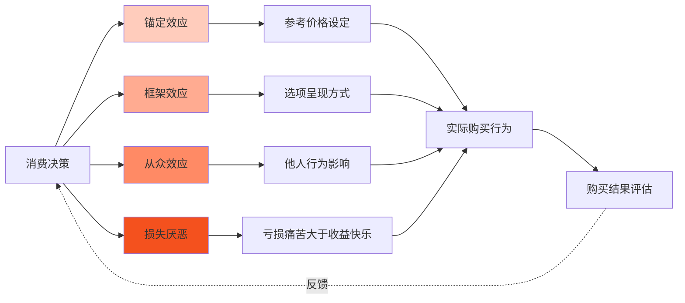
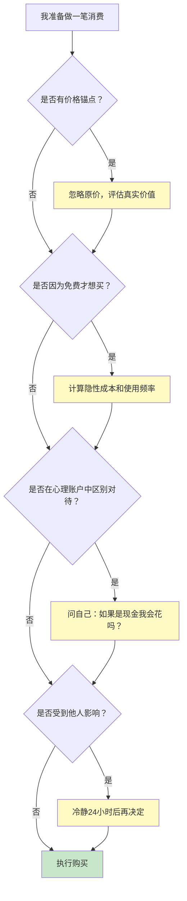

# 《金钱心理学》知识图谱图片描述

本文档包含四个知识图谱的 Mermaid 代码及详细描述，用于生成公众号配图。

---

## 图一：非理性决策因素树（Tree Diagram）

### Mermaid 代码

### 设计说明

- 自上而下的树状结构，根节点为"非理性金钱决策"
- 四个主分支对应艾瑞里的核心理论
- 每个分支三个子节点，详细展开各理论的具体表现
- 配色建议：根节点用深橙色，主分支用暖色调渐变，子节点用浅色

---

## 图二：消费决策影响因素网络图（Network Diagram）

### 设计说明

- 以"消费决策"为起点，展示四种主要心理效应如何影响最终购买行为
- 箭头方向展示因果链条，虚线箭头表示反馈回路
- 四个心理效应节点颜色递进加深，象征影响力递增
- 适合用流程图的方式呈现，突出决策的循环性

---

## 图三：理性消费养成路径图（Path Diagram）

### 设计说明

- 水平路径图，展示从认识到实践的理性消费养成过程
- 颜色由浅绿到深绿，象征理性程度的逐步提升
- 每个节点标注一个具体行动步骤
- 建议在图下方添加进度条，帮助读者追踪自己的成长阶段

---

## 图四：消费陷阱识别决策图（Graph Diagram）

### 设计说明

- 采用决策流程图形式，帮助读者在每次消费前进行系统性的理性检查
- 四个判断节点分别对应四大非理性效应
- 黄色节点为"陷阱应对策略"，绿色节点为"安全通过"
- 形成完整的消费决策检查清单

---

## 使用建议

1. 四个图谱分别对应：非理性因素体系、消费决策网络、理性养成路径、消费陷阱识别
2. 建议全系列使用橙绿色调配色方案，与行为经济学"警告与理性"的主题一致
3. 图四的决策流程图可以单独提取出来作为读者日常使用的消费检查卡片
4. 渲染后建议在图片周围添加简要的文字说明，帮助读者理解各节点含义
5. 公众号排版时建议每张图配一个对应的实际案例
