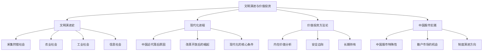
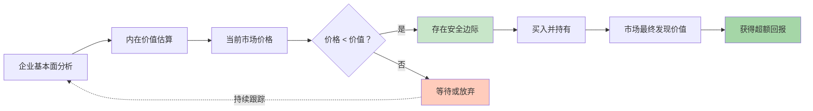
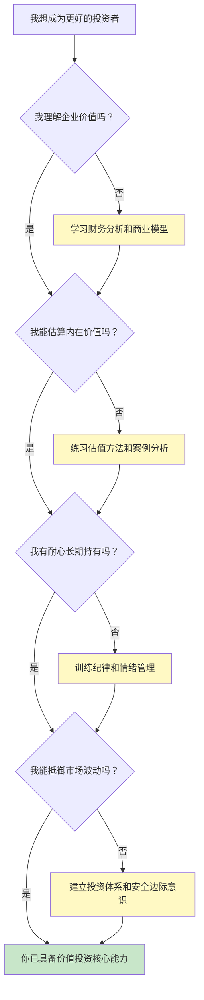

# 《文明、现代化、价值投资与中国》知识图谱图片描述

本文档包含四个知识图谱的 Mermaid 代码及详细描述，用于生成公众号配图。

---

## 图一：文明演进与价值投资体系树（Tree Diagram）

### Mermaid 代码

### 设计说明

- 自上而下的树状结构，根节点为"文明演进与价值投资"
- 四个主分支：文明史、现代化、价值投资、中国股市
- 分支节点数量根据内容需要自然分布
- 配色建议：根节点深棕色，文明相关分支用土黄色系，投资相关分支用深绿色系

---

## 图二：价值投资逻辑网络图（Network Diagram）

### 设计说明

- 以价值投资的核心决策逻辑为主线
- 展示从基本面分析到最终获利的完整链条
- 判断节点用菱形，安全决策用绿色，等待决策用橙色
- 虚线表示"持续跟踪"的反馈回路
- 适合用流程图方式呈现，突出逻辑的严密性

---

## 图三：中国现代化进程路径图（Path Diagram）

### 设计说明

- 水平路径图，展示中国从近代到现代的历史进程
- 颜色由浅红到深红，象征从危机到崛起的转变
- 关键节点标注年份和事件，增强历史纵深感
- 建议在图下方添加一条对应的GDP增长曲线
- 最后三个节点从宏观历史过渡到投资主题

---

## 图四：投资者能力成长决策图（Graph Diagram）

### 设计说明

- 采用决策流程图形式，帮助读者评估自己的投资能力成长路径
- 四个能力阶段：理解企业、估算价值、长期持有、抵御波动
- 黄色节点为能力提升行动，绿色节点为最终目标
- 形成递进式结构，体现能力的阶梯式成长
- 适合投资者作为自我评估工具使用

---

## 使用建议

1. 四个图谱分别对应：文明与投资框架体系、价值投资核心逻辑、中国现代化进程、投资者能力成长路径
2. 建议全系列使用棕红色调配色方案，呼应文明史与投资主题
3. 图三的历史路径图适合作为理解中国宏观经济背景的视觉辅助
4. 图四的能力决策图可以作为读者自我评估的实用工具
5. 渲染后建议在每张图旁配以简要的文字说明，增强理解
