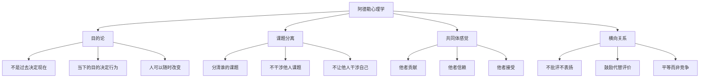
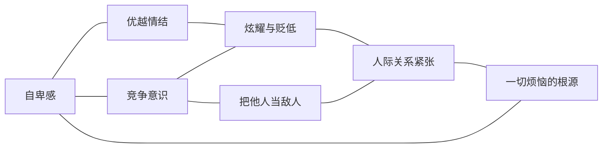
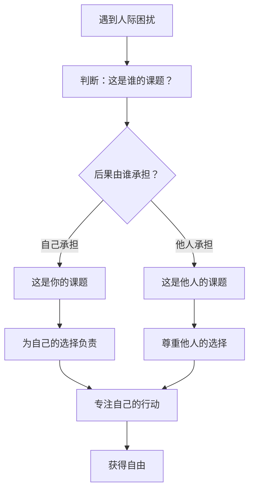
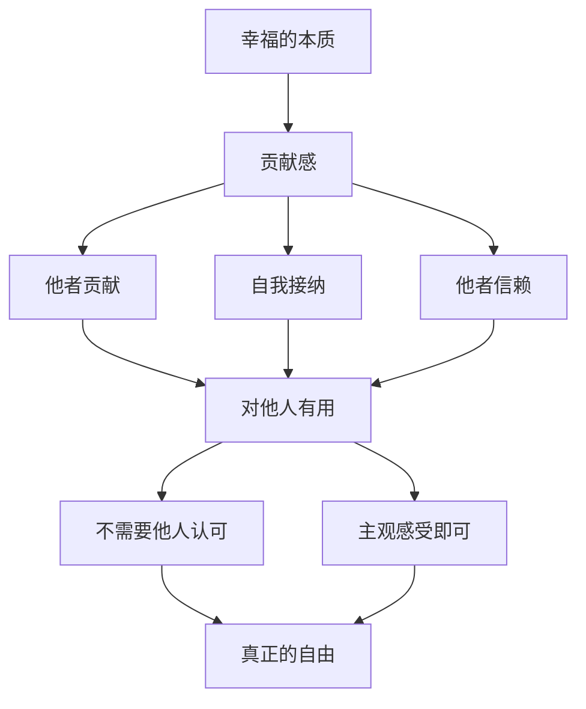

# 知识图谱图片描述 - 被讨厌的勇气

本文档包含 4 张 Mermaid 知识图谱的描述与代码，用于可视化《被讨厌的勇气》核心概念体系。

---

## 图一：阿德勒心理学核心概念树

以阿德勒心理学为根节点，逐层展开书中核心概念的树状结构图。

---

## 图二：人际关系烦恼网络

展示书中各种人际烦恼之间的关联网络，帮助读者看清烦恼的本质。

---

## 图三：课题分离实践路径

以路径图的形式，展示从困扰到自由的实践步骤。

---

## 图四：幸福与贡献感关系图

展示书中关于幸福本质的核心观点：幸福即贡献感。

