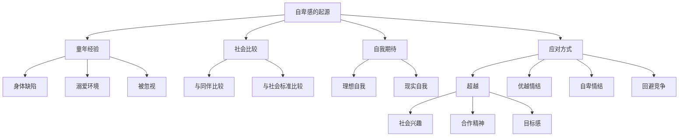
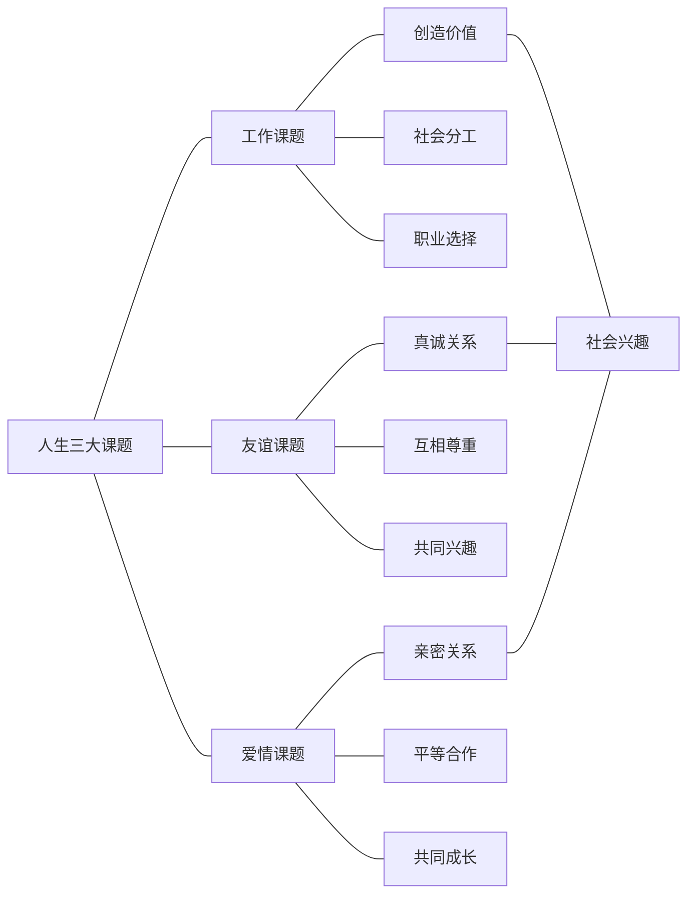
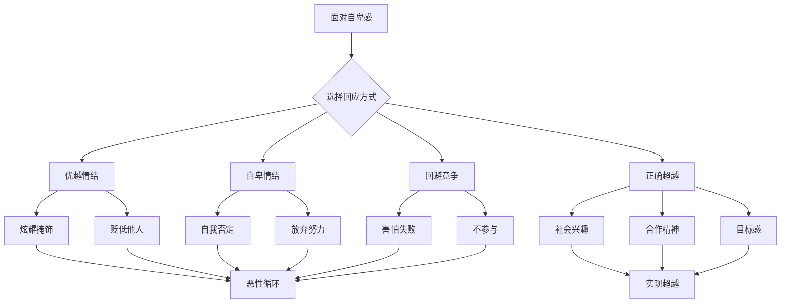
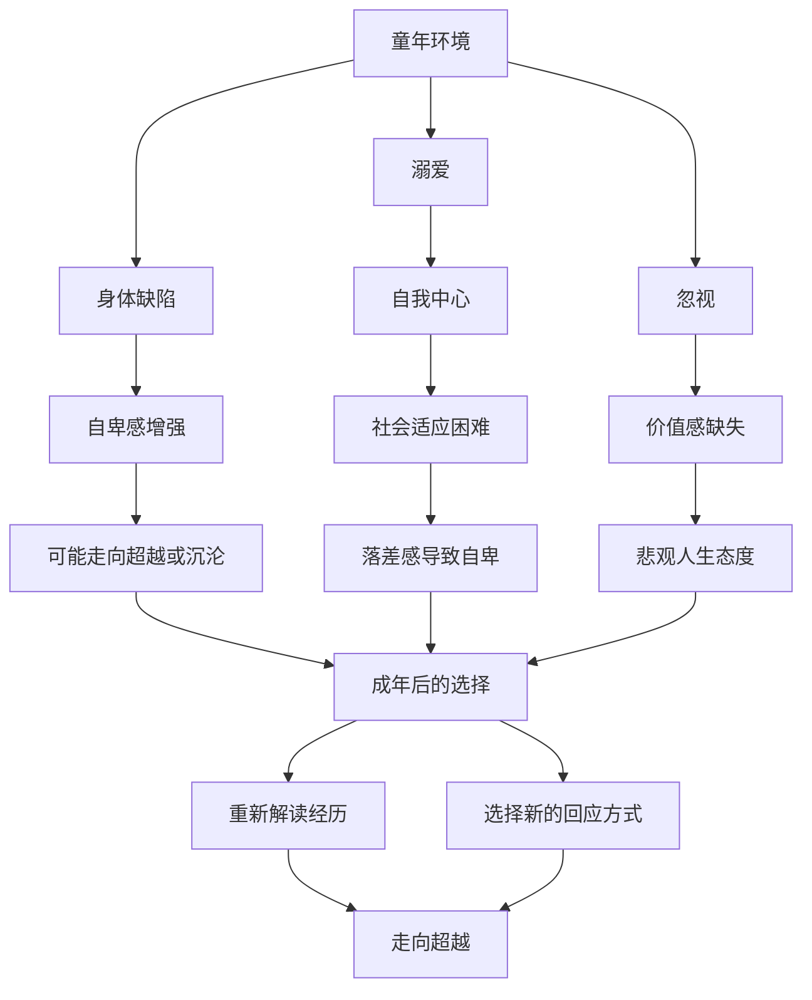

# 知识图谱图片描述 - 自卑与超越

本文档包含 4 张 Mermaid 知识图谱的描述与代码，用于可视化《自卑与超越》核心概念体系。

---

## 图一：自卑感形成与超越路径树

以自卑感为核心，展示从自卑到超越的完整路径结构。

---

## 图二：人生三大课题网络

展示工作、友谊、爱情三大课题之间的关联网络。

---

## 图三：错误应对方式与正确路径对比

以路径图的形式对比三种错误应对方式与正确的超越路径。

---

## 图四：童年环境与人格发展关系图

展示不同童年环境对人格发展的影响路径。

