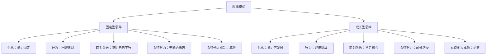
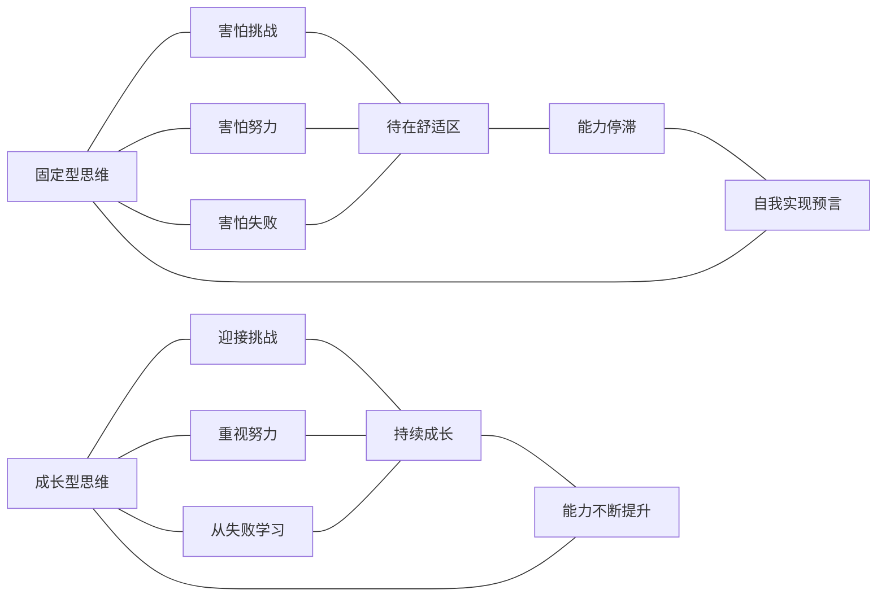
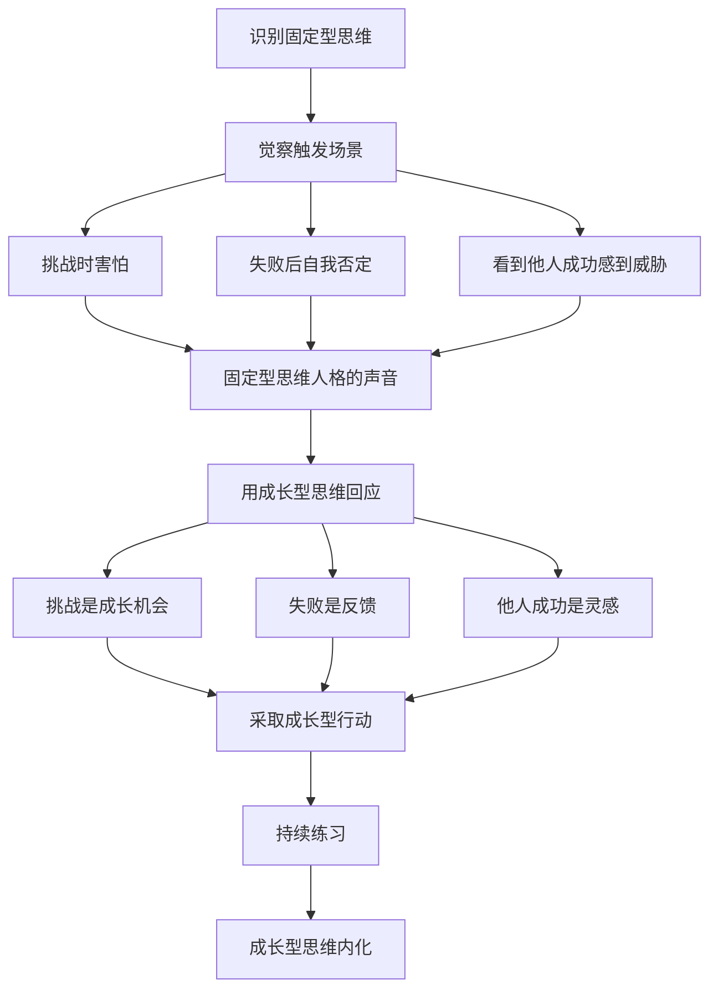
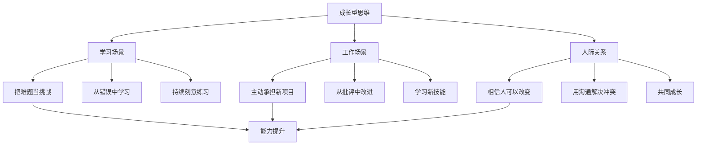

# 知识图谱图片描述 - 终身成长

本文档包含 4 张 Mermaid 知识图谱的描述与代码，用于可视化《终身成长》核心概念体系。

---

## 图一：两种思维模式对比树

以两种思维模式为根节点，逐层对比其信念、行为和结果的树状结构图。

---

## 图二：思维模式影响网络

展示思维模式如何影响行为、情绪和结果的关联网络。

---

## 图三：从固定型到成长型的转变路径

以路径图的形式展示思维模式转变的步骤。

---

## 图四：成长型思维在不同场景的应用图

展示成长型思维在学习、工作、关系中的具体应用。

