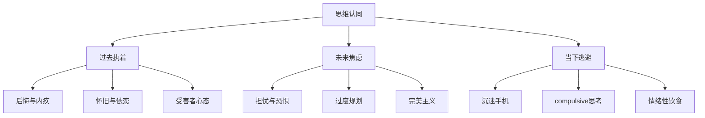
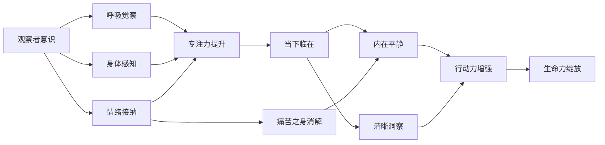
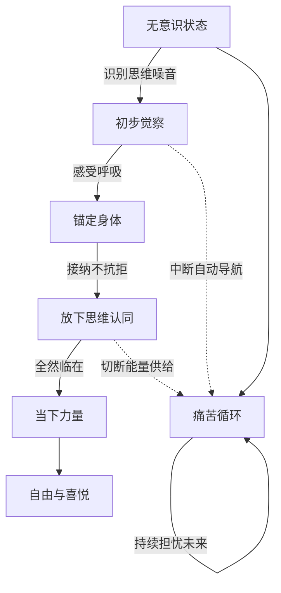
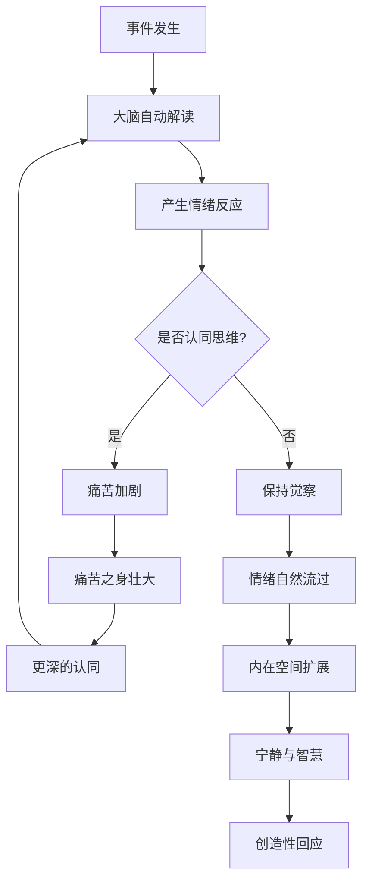

# 知识图谱图片描述

## 图一：思维认同的层级树

说明：以树形结构展示"思维认同"的三个主要分支。根节点为"思维认同"，向下分为"过去执着""未来焦虑""当下逃避"三大维度，每个维度再展开三种具体表现形态，共计12个末端节点。

---

## 图二：意识觉醒的网络关系

说明：网络图展示从"观察者意识"到"生命力绽放"的完整觉醒路径。核心节点"观察者意识"向外辐射三种觉察方式，汇聚为"专注力提升"，再通向"当下临在"，最终产生内在平静与清晰洞察两大果实。

---

## 图三：回归当下的路径图

说明：路径图展示从"无意识状态"到"当下力量"的转化路线。左侧为主路径，右侧展示"痛苦循环"的自强化机制，觉察行为会中断循环，放下认同会切断能量供给。

---

## 图四：痛苦与临在的关系图

说明：流程图展示事件发生后两条截然不同的路径。认同思维会进入痛苦循环，保持觉察则进入智慧回应。关键分叉点在于"是否认同思维"这一觉察时刻。
