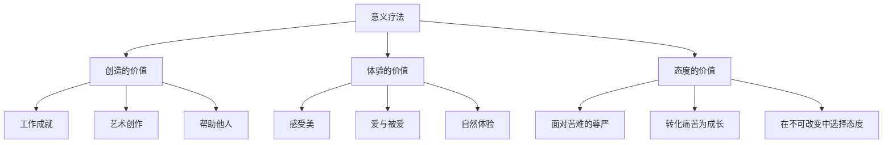
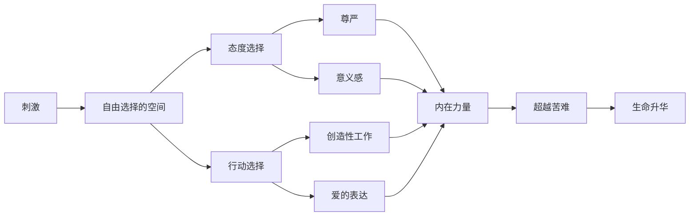
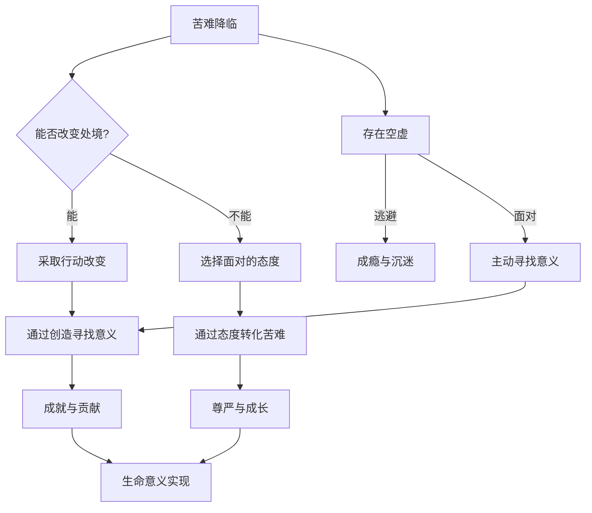
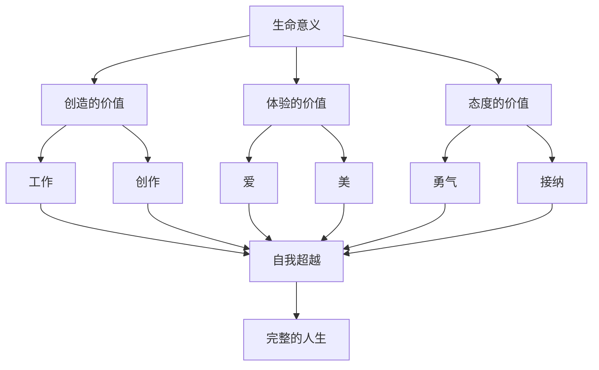

# 知识图谱图片描述

## 图一：意义疗法的概念树

说明：树形图展示意义疗法的三大价值支柱。根节点为"意义疗法"，分为"创造的价值""体验的价值""态度的价值"三个分支，每个分支再展开三种具体表现形式。

---

## 图二：人类自由选择的网络关系

说明：网络图展示弗兰克尔的核心命题"刺激与反应之间的自由空间"。从"刺激"到"反应"之间，存在一个可以选择的态度和行动空间，这个空间通向尊严、意义感和内在力量。

---

## 图三：从苦难到意义的路径

说明：路径图展示面对苦难的两条主线。核心分叉点是"能否改变处境"，能则通过创造寻找意义，不能则通过态度转化苦难。下方补充"存在空虚"的应对路径。

---

## 图四：三种价值与生命意义的关系图

说明：关系图展示三种价值如何汇聚为"自我超越"，最终成就"完整的人生"。每种价值通过不同的具体途径，都指向同一个终点——超越自我，找到生命意义。
