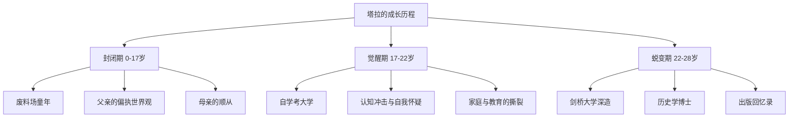
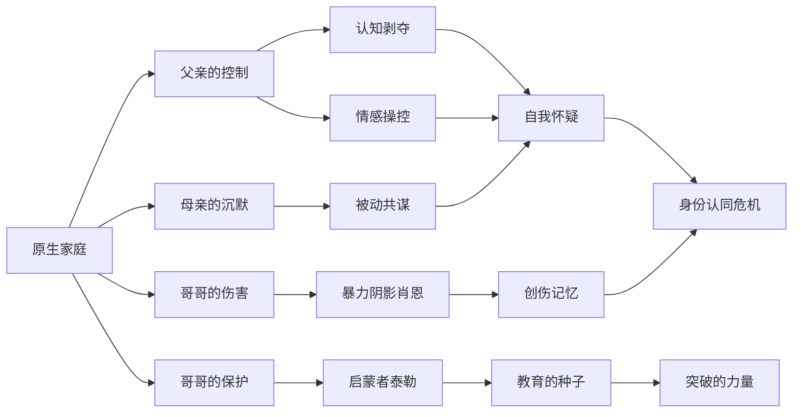
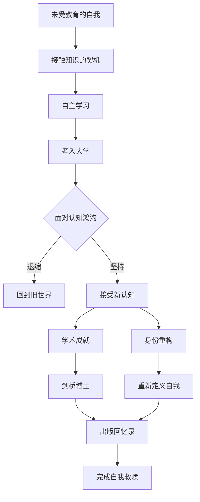
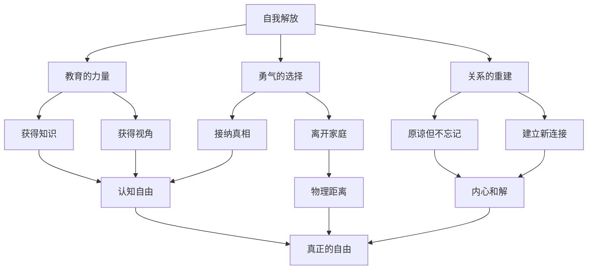

# 知识图谱图片描述

## 图一：塔拉成长阶段的层级树

说明：树形图以时间轴为脉络，展示塔拉从出生到博士毕业的三个成长阶段。每个阶段展开三个关键节点，清晰呈现从封闭到觉醒再到蜕变的完整历程。

---

## 图二：原生家庭影响的关系网络

说明：网络图展示原生家庭中不同角色对塔拉的多重影响。父亲的控制和母亲的沉默造成负面影响，哥哥泰勒提供正面启蒙，哥哥肖恩带来创伤。各方力量汇聚于"自我怀疑"与"身份认同危机"。

---

## 图三：教育改变命运的路径

说明：路径图展示教育改变命运的完整轨迹。关键分叉点在于面对"认知鸿沟"时的选择——退缩回到旧世界，或坚持接受新认知。两条路径导向截然不同的人生。

---

## 图四：自我解放的要素关系图

说明：关系图展示自我解放的三大要素及其相互作用。"教育""勇气""关系"三条路径最终汇聚于"真正的自由"。每个要素通过不同的子路径发挥作用，缺一不可。
