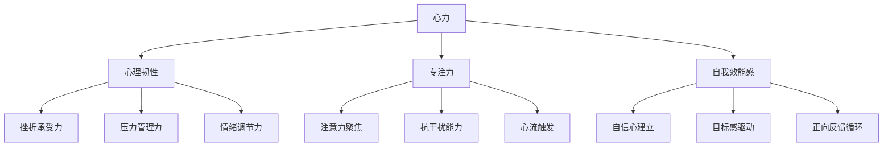
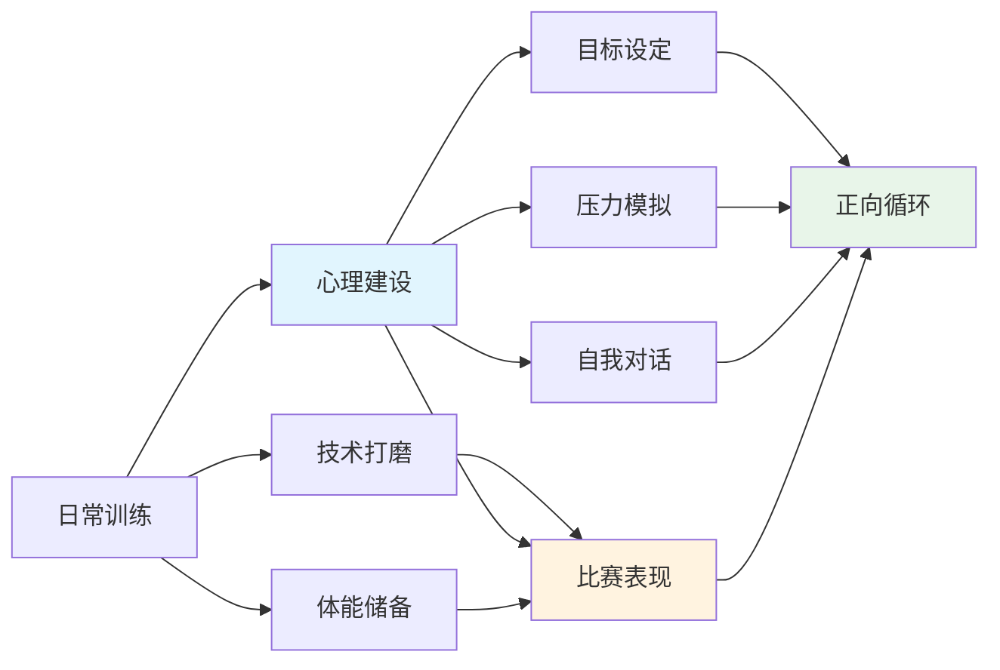
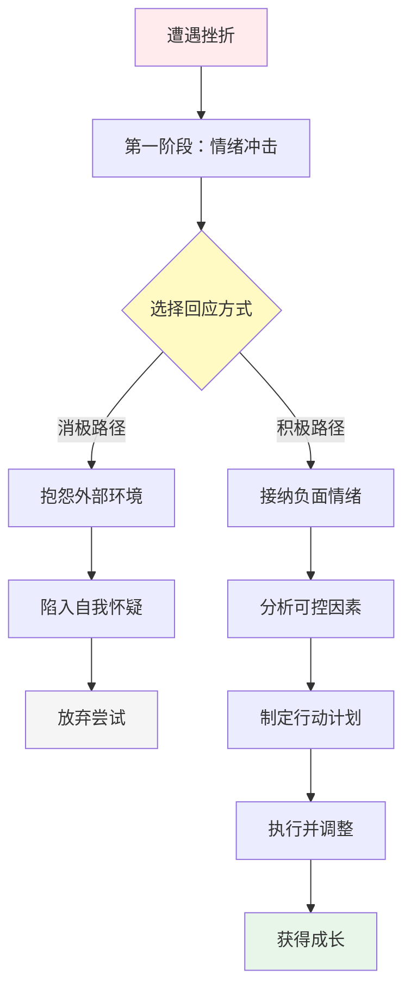
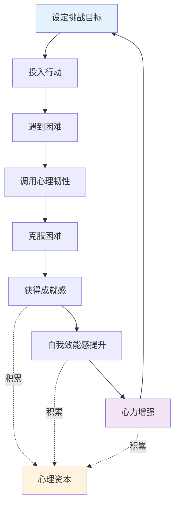

# 知识图谱图片描述 | 《心力》核心概念关系图

本文档描述《心力》知识图谱中需要生成的4张核心图片，分别使用不同的图表类型展示书中核心概念的逻辑关系。

## 图片一：心力构成要素树状图（Tree Diagram）

### 图表类型
Mermaid tree diagram

### 图表描述
展示"心力"作为根节点，向下分解为三大核心支柱，每个支柱再细分为具体能力要素。

### Mermaid 代码

### 视觉说明
- 根节点"心力"使用醒目的中心位置
- 三大支柱用不同颜色区分
- 子节点使用渐变色，体现层次递进

---

## 图片二：冠军心态训练网络图（Network Diagram）

### 图表类型
Mermaid network/graph diagram

### 图表描述
展示邓亚萍冠军心态训练体系中各要素之间的交叉关联关系，体现训练方法的系统性和互通性。

### Mermaid 代码

### 视觉说明
- 节点大小根据重要程度区分
- 连线粗细表示关联强度
- 关键路径用高亮色标注

---

## 图片三：面对挫折的心路历程路径图（Path Diagram）

### 图表类型
Mermaid path/flow diagram

### 图表描述
展示一个人在面对挫折时，从消极反应到积极应对的心路历程转变路径。

### Mermaid 代码

### 视觉说明
- 路径分叉点用菱形突出
- 消极路径用灰色调
- 积极路径用暖色调，传递正向能量

---

## 图片四：心力成长飞轮效应图（Graph Diagram）

### 图表类型
Mermaid circular/graph diagram

### 图表描述
展示心力培养的飞轮效应：每一次心理突破都会增强下一次面对挑战的信心，形成正向循环。

### Mermaid 代码

### 视觉说明
- 主循环用圆形排列，体现飞轮效应
- "心理资本"作为蓄水池，展示长期积累
- 箭头方向清晰，体现因果关系
