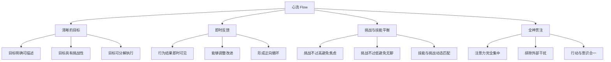
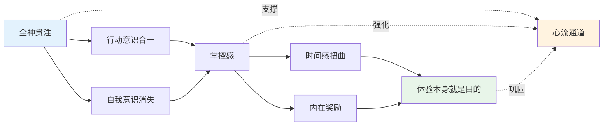
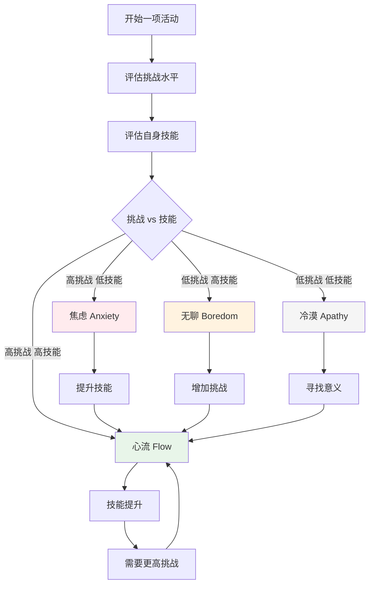
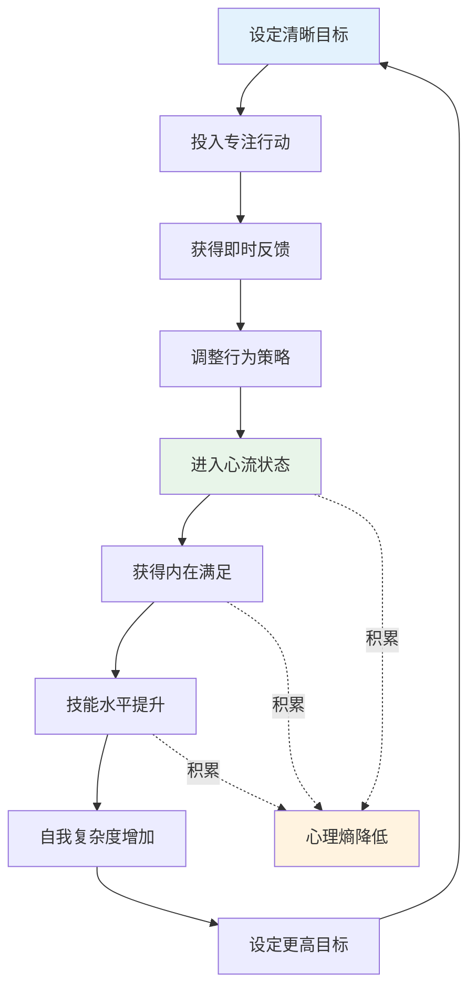

# 知识图谱图片描述 | 《心流》核心概念关系图

本文档描述《心流》知识图谱中需要生成的4张核心图片，分别使用不同的图表类型展示契克森米哈赖心流理论的逻辑关系。

## 图片一：心流触发条件树状图（Tree Diagram）

### 图表类型
Mermaid tree diagram

### 图表描述
展示心流产生的核心条件及其子维度，以"心流"为根节点，逐层分解触发要素。

### Mermaid 代码

### 视觉说明
- 根节点"心流"居中放大显示
- 四大条件用不同色系区分
- 子节点按逻辑层级排列

---

## 图片二：心流体验构成网络图（Network Diagram）

### 图表类型
Mermaid network/graph diagram

### 图表描述
展示心流体验的八大特征要素之间的交叉关联，体现心流状态的系统性和整体性。

### Mermaid 代码

### 视觉说明
- 核心特征节点用大圆形
- 关联连线用不同粗细表示关联强度
- "心流通道"节点用暖色高亮

---

## 图片三：挑战与技能的动态关系路径图（Path Diagram）

### 图表类型
Mermaid path/flow diagram

### 图表描述
展示一个人在面对不同挑战与技能匹配关系时的心理状态变化路径。

### Mermaid 代码

### 视觉说明
- 心流区域用绿色高亮
- 焦虑用红色，无聊用橙色，冷漠用灰色
- 从非心流状态到心流的路径用箭头标注

---

## 图片四：心飞轮效应图（Graph Diagram）

### 图表类型
Mermaid circular/graph diagram

### 图表描述
展示心流体验的正向循环机制：进入心流后如何持续提升自我，形成螺旋上升的成长路径。

### Mermaid 代码

### 视觉说明
- 主循环用环形排列体现飞轮效应
- "心理熵降低"作为副产品展示
- 箭头方向体现因果循环关系
- 关键节点用颜色编码区分阶段
