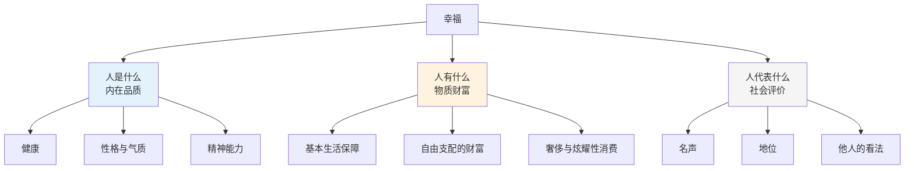
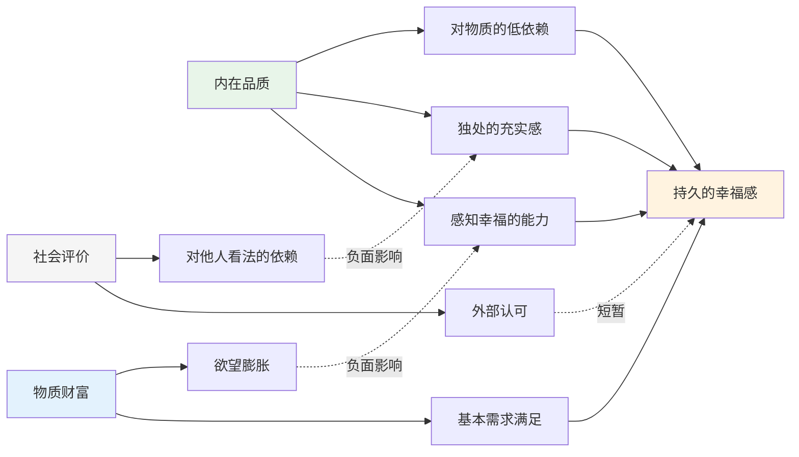
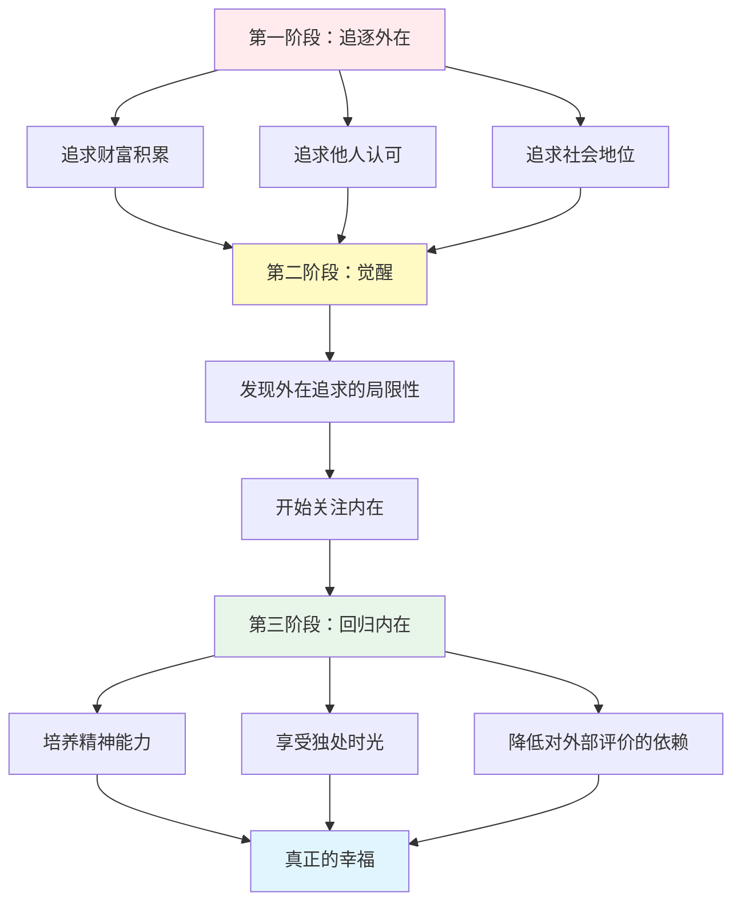
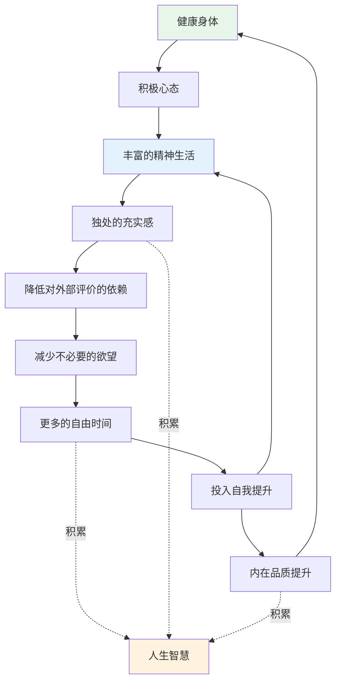

# 知识图谱图片描述 | 《人生的智慧》核心概念关系图

本文档描述《人生的智慧》知识图谱中需要生成的4张核心图片，分别使用不同的图表类型展示叔本华幸福哲学的逻辑结构。

## 图片一：幸福三要素树状图（Tree Diagram）

### 图表类型
Mermaid tree diagram

### 图表描述
以"幸福"为根节点，展示叔本华提出的幸福三大要素及其子维度。

### Mermaid 代码

### 视觉说明
- "人是什么"用蓝色突出，表示最重要的要素
- "人有什么"用橙色，表示次要但必要的要素
- "人代表什么"用灰色，表示最不重要的要素

---

## 图片二：内在与外在幸福网络图（Network Diagram）

### 图表类型
Mermaid network/graph diagram

### 图表描述
展示内在品质、物质财富和社会评价三者之间的相互影响关系。

### Mermaid 代码

### 视觉说明
- 内在品质相关节点用绿色
- 物质财富相关节点用蓝色
- 社会评价相关节点用灰色
- 负面影响用虚线表示

---

## 图片三：从外在追求到内在觉醒的路径图（Path Diagram）

### 图表类型
Mermaid path/flow diagram

### 图表描述
展示一个人从追求外在认可到回归内在觉醒的心路历程。

### Mermaid 代码

### 视觉说明
- 三个阶段用不同底色区分
- 路径从红色区域逐步过渡到绿色区域
- "真正的幸福"用高亮色标注

---

## 图片四：幸福飞轮：内在品质的正循环图（Graph Diagram）

### 图表类型
Mermaid circular/graph diagram

### 图表描述
展示内在品质如何形成自我强化的幸福飞轮。

### Mermaid 代码

### 视觉说明
- 飞轮循环用环形排列
- "人生智慧"作为副产品用暖色标注
- 箭头方向体现因果循环关系
