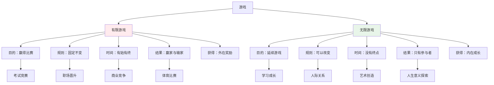
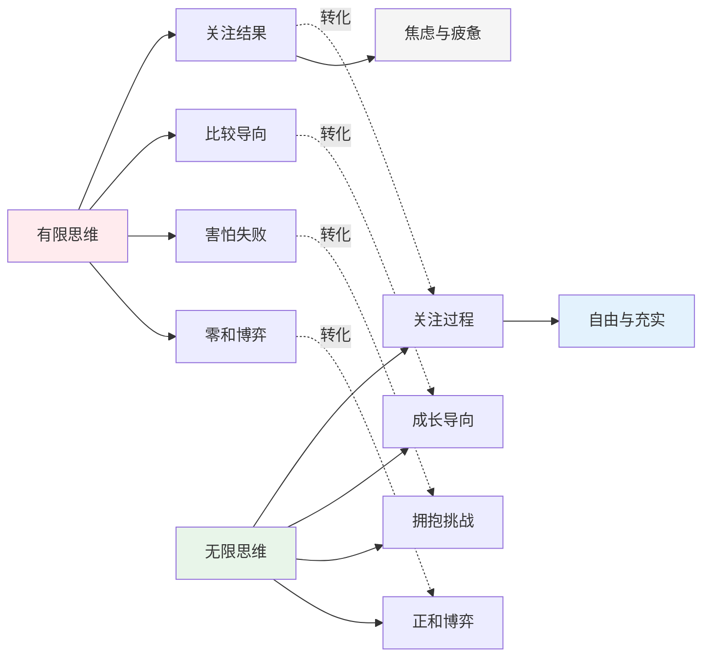
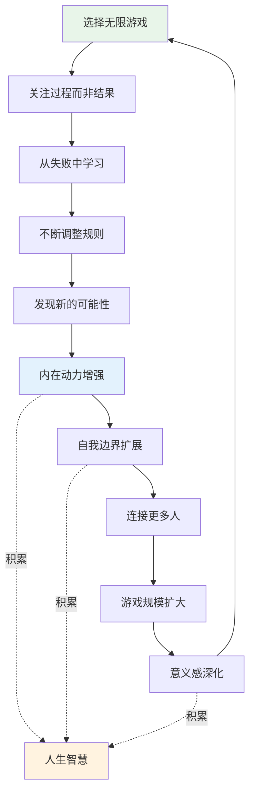

# 知识图谱图片描述 | 《有限与无限的游戏》核心概念关系图

本文档描述《有限与无限的游戏》知识图谱中需要生成的4张核心图片，分别使用不同的图表类型展示卡斯的游戏理论框架。

## 图片一：两种游戏对比树状图（Tree Diagram）

### 图表类型
Mermaid tree diagram

### 图表描述
以"游戏"为根节点，分为"有限游戏"和"无限游戏"两大分支，分别展示其特征和典型场景。

### Mermaid 代码



### 视觉说明
- 有限游戏分支用红色系，暗示紧张和对抗
- 无限游戏分支用绿色系，暗示生长和延续
- 典型场景用浅色节点区分

---

## 图片二：有限与无限思维模式网络图（Network Diagram）

### 图表类型
Mermaid network/graph diagram

### 图表描述
展示有限思维和无限思维在人生各个维度上的交叉对比和转化关系。

### Mermaid 代码



### 视觉说明
- 有限思维用红色，无限思维用绿色
- 转化路径用虚线，表示思维模式可以转换
- 结果状态用不同底色区分

---

## 图片三：人生游戏转换路径图（Path Diagram）

### 图表类型
Mermaid path/flow diagram

### 图表描述
展示一个人从有限游戏思维到无限游戏思维的心智转换路径。

### Mermaid 代码

```mermaid
graph TD
    A[起点：有限游戏玩家] --> B[意识到有限游戏的局限]
    B --> C[发现"赢了也不快乐"]
    C --> D[开始质疑游戏规则]
    
    D --> E{关键转折点}
    
    E -->|选择1| F[继续追求更多胜利]
    F --> G[陷入更深的空虚]
    G --> E
    
    E -->|选择2| H[尝试无限游戏思维]
    H --> I[发现过程的乐趣]
    I --> J[重新定义成功]
    J --> K[找到内在驱动力]
    K --> L[终点：无限游戏玩家]
    
    style A fill:#ffebee
    style E fill:#fff9c4
    style L fill:#e8f5e9
    style G fill:#f5f5f5
```

### 视觉说明
- 路径从红色区域逐步过渡到绿色区域
- 关键转折点用黄色高亮
- 循环路径用返回箭头表示

---

## 图片四：无限游戏飞轮效应图（Graph Diagram）

### 图表类型
Mermaid circular/graph diagram

### 图表描述
展示无限游戏思维如何形成自我强化的成长飞轮。

### Mermaid 代码



### 视觉说明
- 飞轮循环用环形排列
- "人生智慧"作为副产品用暖色标注
- 箭头方向体现正向循环关系
