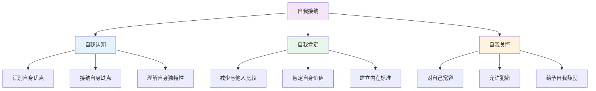
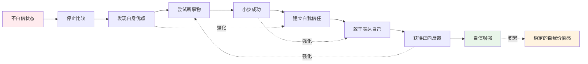
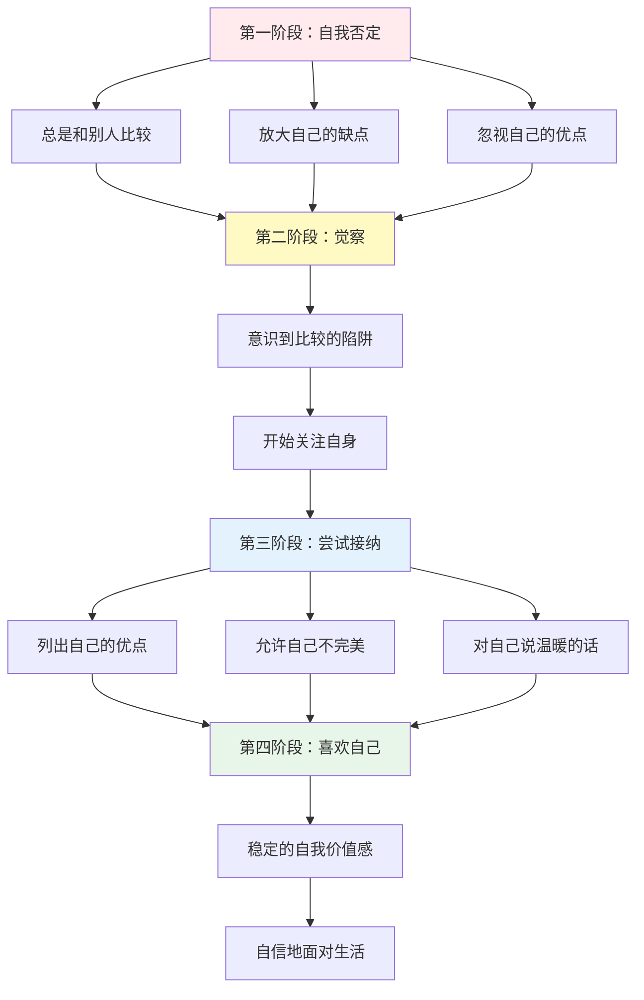
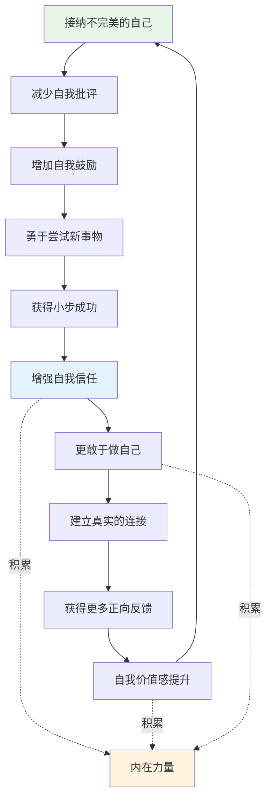

# 知识图谱图片描述 | 《真希望你也喜欢自己》核心概念关系图

本文档描述《真希望你也喜欢自己》知识图谱中需要生成的4张核心图片，分别使用不同的图表类型展示自我接纳与自信培养的核心理念。

## 图片一：自我接纳树状图（Tree Diagram）

### 图表类型
Mermaid tree diagram

### 图表描述
以"自我接纳"为根节点，逐层分解为自我认知、自我肯定、自我关怀三大维度及其子要素。

### Mermaid 代码

### 视觉说明
- 根节点"自我接纳"用紫色突出
- 三大维度用不同色系区分
- 子节点按逻辑层级排列

---

## 图片二：自信培养路径网络图（Network Diagram）

### 图表类型
Mermaid network/graph diagram

### 图表描述
展示从"不自信"到"自信"的转变过程中，各关键行动要素之间的关联和强化关系。

### Mermaid 代码

### 视觉说明
- 从不自信到自信用颜色渐变
- 强化关系用虚线表示
- "稳定的自我价值感"作为最终成果用暖色标注

---

## 图片三：自我否定到自我接纳的路径图（Path Diagram）

### 图表类型
Mermaid path/flow diagram

### 图表描述
展示一个人从自我否定到自我接纳的完整心路历程。

### Mermaid 代码

### 视觉说明
- 四个阶段用不同底色区分
- 路径从红色过渡到绿色
- "稳定的自我价值感"用高亮色标注

---

## 图片四：自我关爱飞轮效应图（Graph Diagram）

### 图表类型
Mermaid circular/graph diagram

### 图表描述
展示自我关爱如何形成正向循环，持续提升自我价值感。

### Mermaid 代码

### 视觉说明
- 飞轮循环用环形排列
- "内在力量"作为核心积累用暖色标注
- 箭头方向体现正向循环关系
