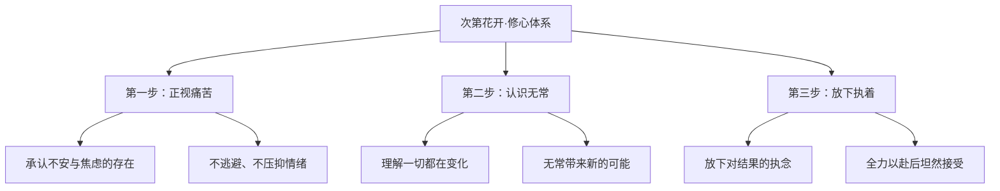
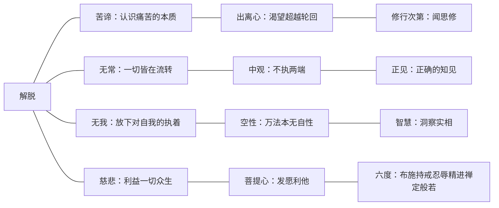
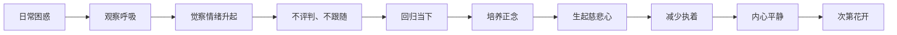
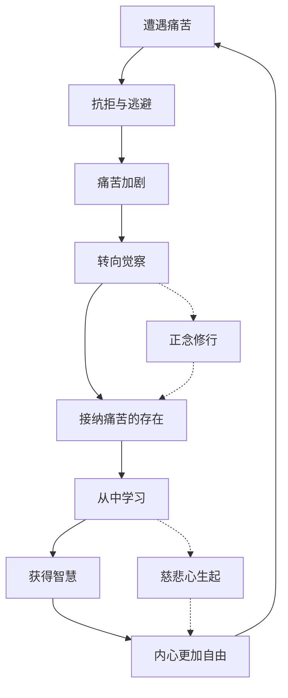

# 《次第花开》知识图谱图片描述

本文档描述《次第花开》核心知识体系的4个Mermaid图，用于生成公众号配图。

---

## 图一：修心次第树状图

展示从困惑到解脱的修行路径，呈自上而下的树状结构。

---

## 图二：佛法智慧网络图

展示佛教核心理念之间的关联网络，中心为"解脱"，向外辐射四大概念。

---

## 图三：日常修行路径图

展示从日常困惑走向内心平静的实践路径，呈线性推进流程。

---

## 图四：痛苦与解脱关系图

展示痛苦如何转化为智慧的循环关系图。

---

## 使用说明

- 所有图表使用 Mermaid 语法，可通过在线渲染器生成PNG或SVG格式图片
- 建议配色方案：主色调使用暖色调（米色、淡金色），体现佛法的温暖与包容
- 图一适合放在文章开头作为总览
- 图二适合放在佛法概念讲解部分
- 图三适合放在实践方法部分
- 图四适合放在痛苦与转化部分
