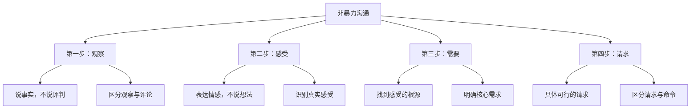
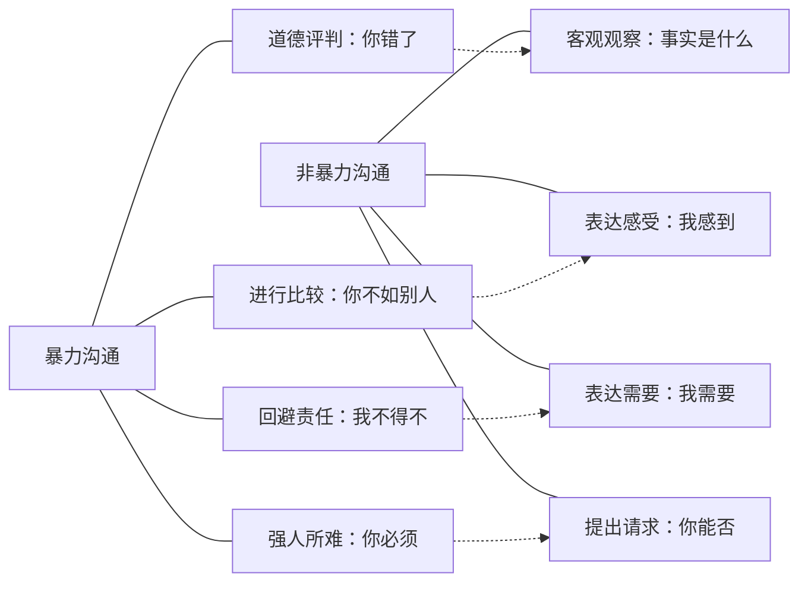
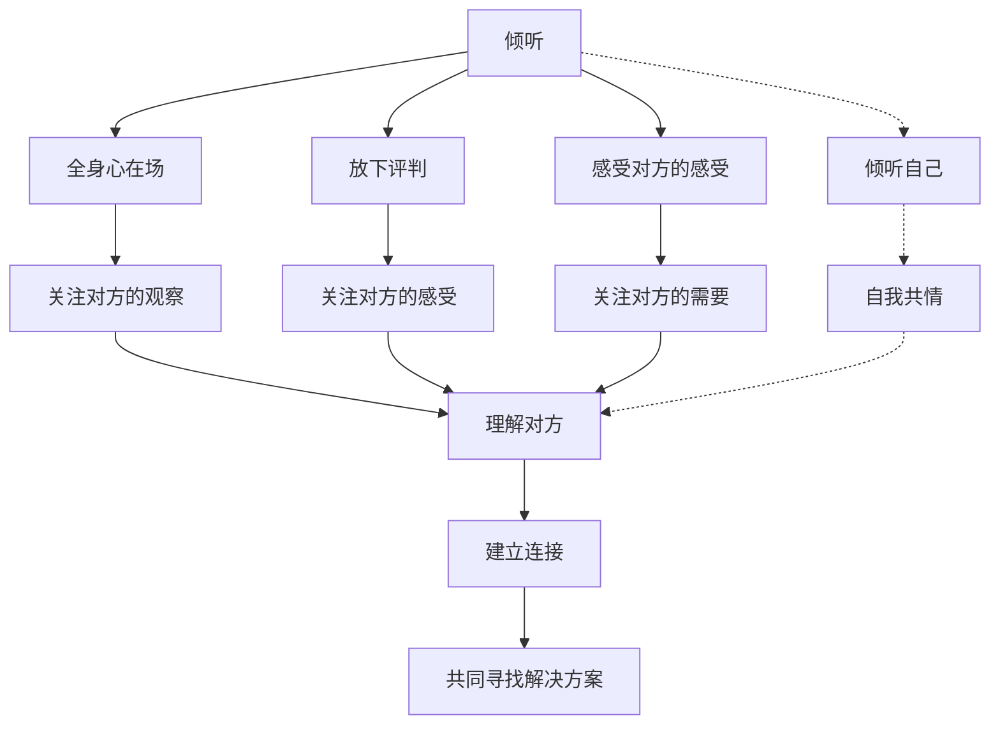

# 《非暴力沟通》知识图谱图片描述

本文档描述《非暴力沟通》核心知识体系的4个Mermaid图，用于生成公众号配图。

---

## 图一：四步法树状图

展示非暴力沟通四步法的层级结构，从核心到各步骤的具体内容。

---

## 图二：沟通模式对比网络图

展示暴力沟通与非暴力沟通的对比关系网络。

---

## 图三：情绪转化路径图

展示从负面情绪到理解需要的转化路径。

---

## 图四：倾听与共情关系图

展示倾听在非暴力沟通中的核心地位及与共情的关系。

---

## 使用说明

- 所有图表使用 Mermaid 语法，可通过在线渲染器生成PNG或SVG格式图片
- 建议配色方案：使用蓝绿色系，传达平静、理性和共情的感觉
- 图一适合放在文章核心方法讲解部分
- 图二适合放在沟通模式对比部分
- 图三适合放在情绪管理部分
- 图四适合放在倾听技巧部分
