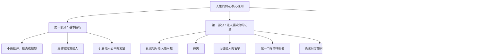
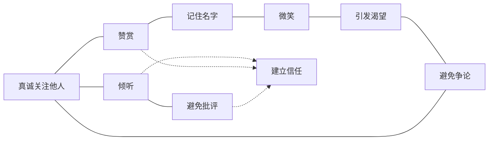
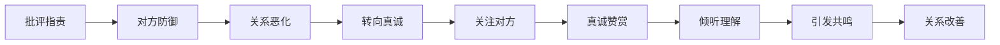
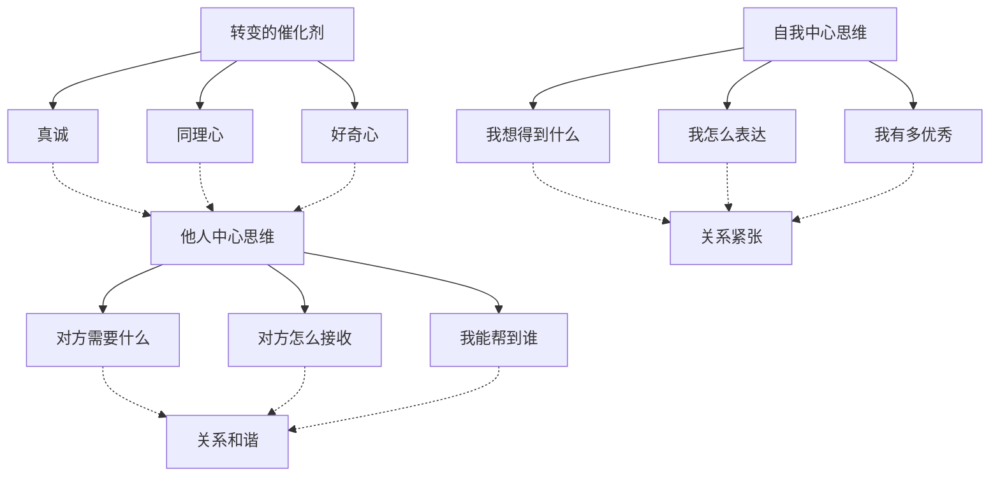

# 《人性的弱点》知识图谱图片描述

本文档描述《人性的弱点》核心知识体系的4个Mermaid图，用于生成公众号配图。

---

## 图一：人际关系原则树状图

展示卡耐基人际关系核心原则的层级结构。

---

## 图二：人际关系网络图

展示人际关系中各要素之间的相互关联。

---

## 图三：沟通效果路径图

展示从无效沟通到有效沟通的转变路径。

---

## 图四：从自我中心到他人中心的转变图

展示思维方式转变的过程和结果。

---

## 使用说明

- 所有图表使用 Mermaid 语法，可通过在线渲染器生成PNG或SVG格式图片
- 建议配色方案：使用暖橙色调，传达温暖、真诚和友好的感觉
- 图一适合放在文章核心原则讲解部分
- 图二适合放在人际关系要素关联部分
- 图三适合放在沟通技巧部分
- 图四适合放在思维方式转变部分
