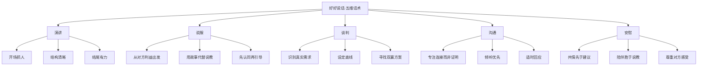
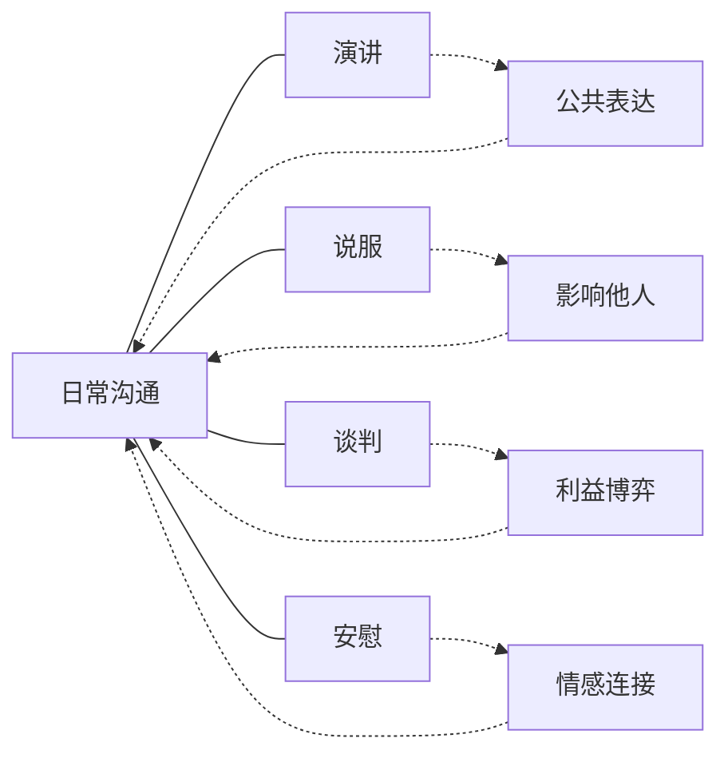
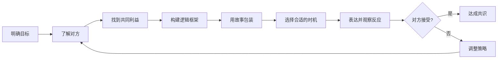
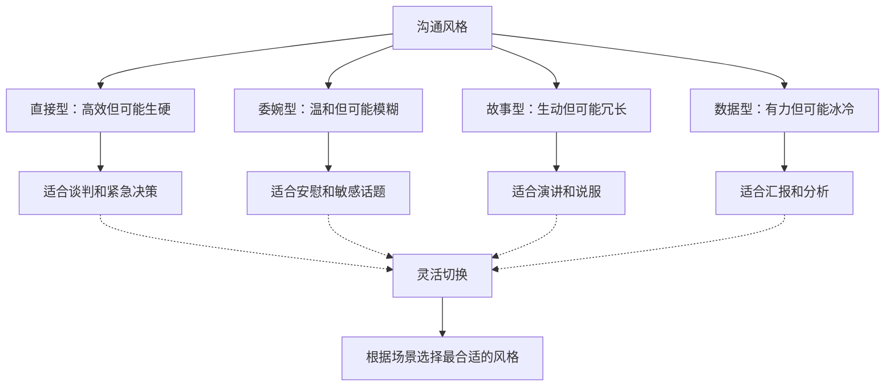

# 《好好说话》知识图谱图片描述

本文档描述《好好说话》核心知识体系的4个Mermaid图，用于生成公众号配图。

---

## 图一：五维话术树状图

展示好好说话五维沟通框架的层级结构。

---

## 图二：沟通场景网络图

展示不同沟通场景之间的关系和转换。

---

## 图三：说服路径图

展示从表达到说服他人的完整路径。

---

## 图四：沟通风格关系图

展示不同沟通风格的适用场景和转换关系。

---

## 使用说明

- 所有图表使用 Mermaid 语法，可通过在线渲染器生成PNG或SVG格式图片
- 建议配色方案：使用蓝紫色系，传达专业、智慧和沟通的感觉
- 图一适合放在文章五维框架讲解部分
- 图二适合放在沟通场景分类部分
- 图三适合放在说服技巧部分
- 图四适合放在沟通风格选择部分
