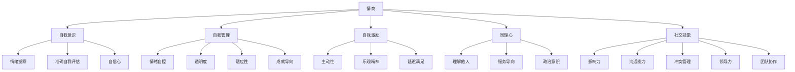
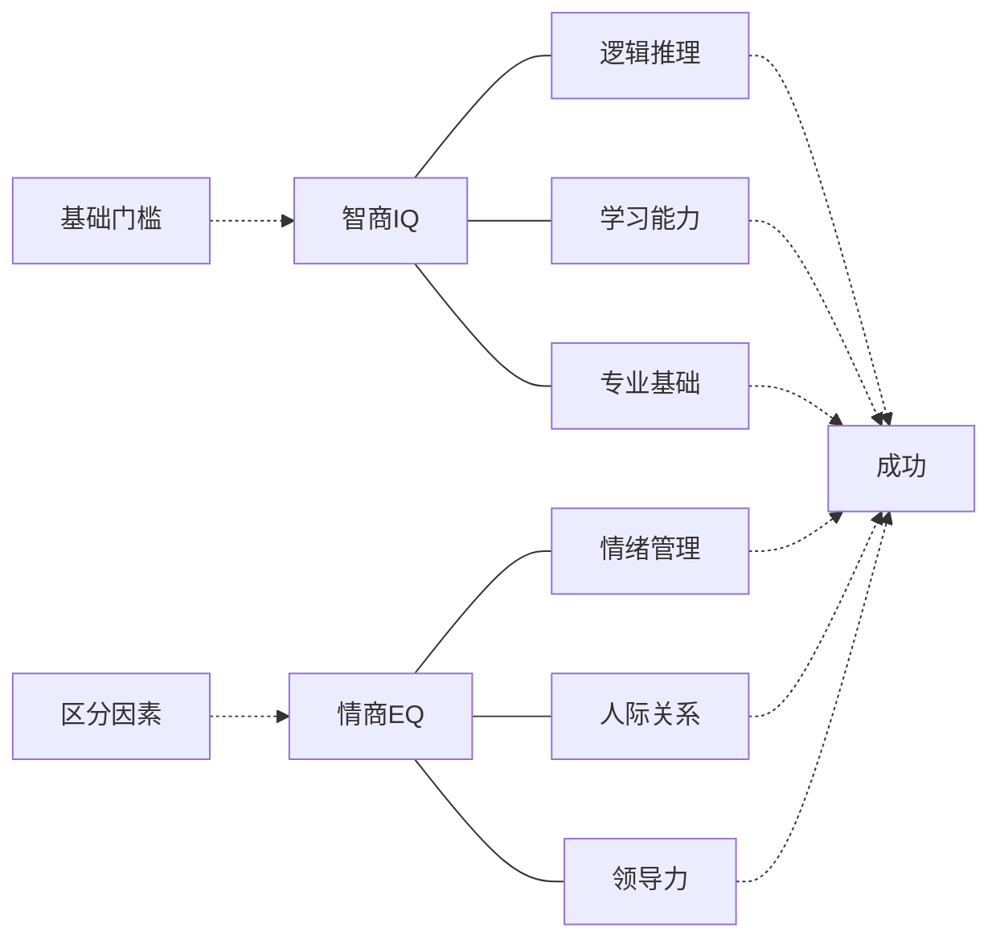
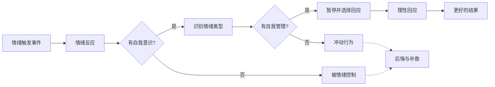
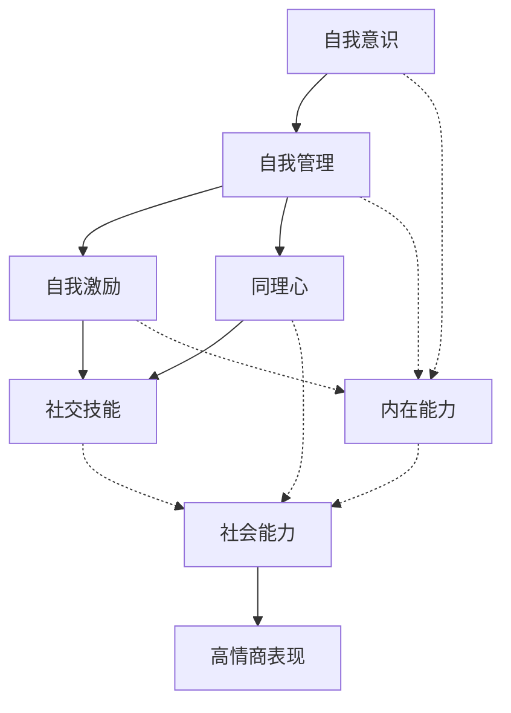

# 《情商》知识图谱图片描述

本文档描述《情商》核心知识体系的4个Mermaid图，用于生成公众号配图。

---

## 图一：情商五维度树状图

展示情商五大维度及其子能力的层级结构。

---

## 图二：情商与智商关系网络图

展示情商与智商在不同场景下的相对重要性。

---

## 图三：情绪管理路径图

展示从情绪触发到理性回应的情绪管理过程。

---

## 图四：情商能力成长图

展示情商各维度之间的递进和相互促进关系。

---

## 使用说明

- 所有图表使用 Mermaid 语法，可通过在线渲染器生成PNG或SVG格式图片
- 建议配色方案：使用蓝绿色系配合暖橙色点缀，传达理性与感性的平衡
- 图一适合放在文章五维度讲解部分
- 图二适合放在情商与智商对比部分
- 图三适合放在情绪管理技巧部分
- 图四适合放在情商培养路径部分
