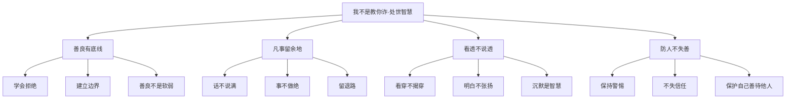
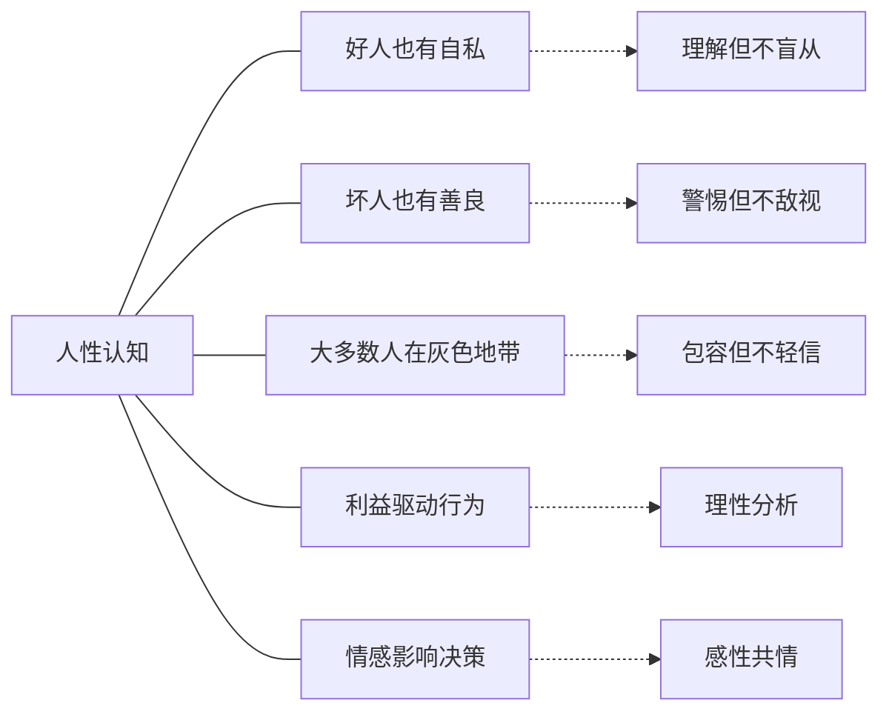
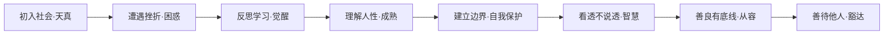
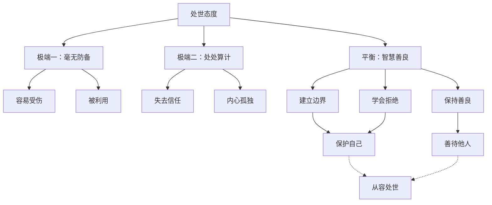

# 《我不是教你诈》知识图谱图片描述

本文档描述《我不是教你诈》核心知识体系的4个Mermaid图，用于生成公众号配图。

---

## 图一：处世智慧树状图

展示刘墉处世智慧的核心原则和具体方法。

---

## 图二：人性认知网络图

展示对人性的多维度理解和应对策略。

---

## 图三：处世策略路径图

展示从初入社会到处世成熟的成长路径。

---

## 图四：保护自己与善待他人的平衡图

展示自我保护与善良之间的平衡关系。

---

## 使用说明

- 所有图表使用 Mermaid 语法，可通过在线渲染器生成PNG或SVG格式图片
- 建议配色方案：使用墨绿色配合金色，传达东方智慧和从容的感觉
- 图一适合放在文章处世原则讲解部分
- 图二适合放在人性理解部分
- 图三适合放在成长路径部分
- 图四适合放在平衡哲学部分
