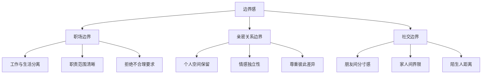
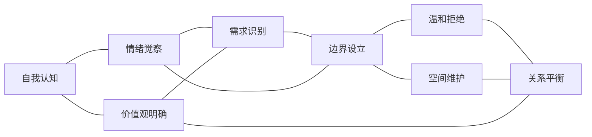
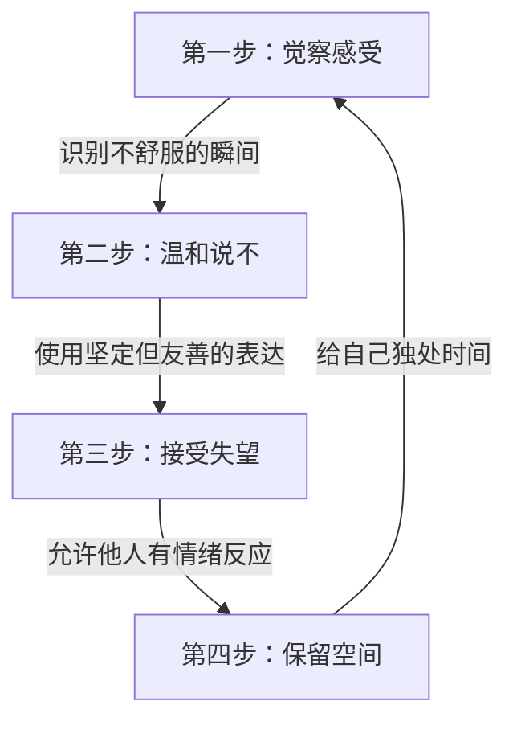

# 知识图谱图片描述 - 《边界感》

## 图一：边界感核心概念树状图

**类型：** tree graph
**用途：** 展示边界感的三层结构体系

**视觉说明：** 顶部为根节点"边界感"，向下分三支（职场/亲密/社交），每支再分三个子节点。整体呈倒树形结构，层次分明。配色建议：根节点深蓝，一级分支蓝绿，二级节点浅绿。

---

## 图二：讨好型人格形成路径图

**类型：** path/flow diagram
**用途：** 呈现讨好型人格从童年到成年的发展路径

**视觉说明：** 从左到右的线性流程，前半段用红色调表示负面循环，"觉察觉醒"处转折为绿色调。虚线箭头表示可以打破循环的关键点。

---

## 图三：边界感六大维度网络图

**类型：** network/relationship graph
**用途：** 展示边界感各要素之间的关联

**视觉说明：** 网状结构，节点大小按重要性区分。"自我认知"和"情绪觉察"为较大节点，"关系平衡"为最终汇聚点。连线粗细表示关联强度。

---

## 图四：边界感建立四步循环图

**类型：** cycle/path diagram
**用途：** 呈现建立边界感的实践步骤闭环

**视觉说明：** 顺时针循环结构，四个节点均匀分布成方形或圆形。每个节点内包含步骤名称和简要说明。箭头连接形成闭环，表示这是一个持续迭代的过程。配色建议：四个步骤用渐变色（蓝→绿→青→蓝），表示循环往复。
