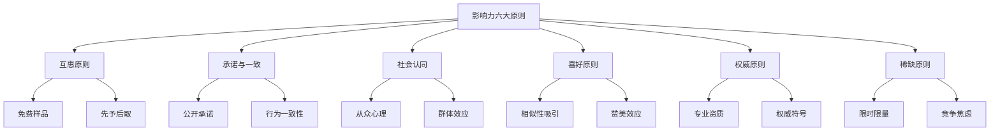
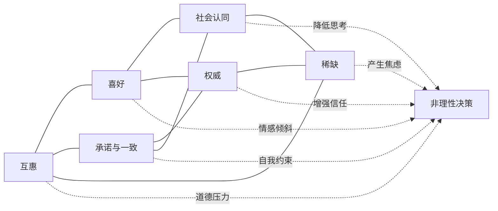
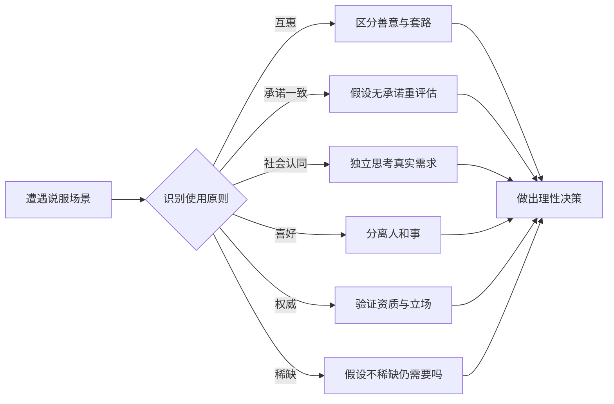
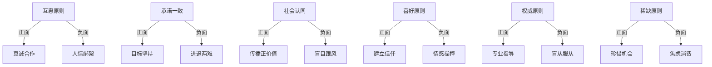

# 知识图谱图片描述 - 《影响力》

## 图一：影响力六大原则树状图

**类型：** tree graph
**用途：** 展示西奥迪尼提出的六大说服原则及其子维度

**视觉说明：** 顶部根节点"影响力六大原则"，向下均匀分六支。每支再分两个子节点。整体倒树形。配色建议：根节点深红，六个一级分支用不同色系（橙、黄、绿、蓝、紫、青），二级节点用对应浅色调。

---

## 图二：说服过程网络图

**类型：** network/relationship graph
**用途：** 展示六大原则之间的相互关系和作用路径

**视觉说明：** 左侧六个原则形成网状互联，右侧汇聚到"非理性决策"节点。实线表示原则间相互强化，虚线箭头表示对决策的影响路径。配色：左侧原则用彩色，右侧决策节点用灰色。

---

## 图三：影响力防御路径图

**类型：** path/flow diagram
**用途：** 呈现面对影响力操控时的识别与防御流程

**视觉说明：** 从左到右的流程。起点"遭遇说服场景"，中间分支节点根据识别的原则进入不同防御路径，最终汇聚到"做出理性决策"。配色：起点深蓝，中间分支用彩色区分，终点绿色。

---

## 图四：影响力正负应用对比图

**类型：** cycle/graph diagram
**用途：** 对比影响力的正面应用和负面操控

**视觉说明：** 三列布局。左列六个原则，中间列正面应用（绿色调），右列负面操控（红色调）。每个原则分叉为两条路径，用不同颜色箭头区分正负应用。
