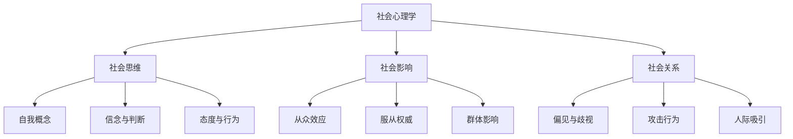
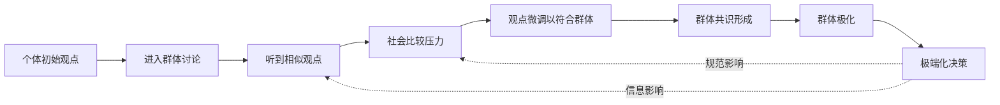
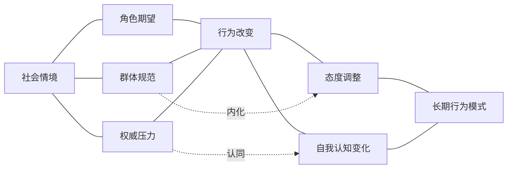
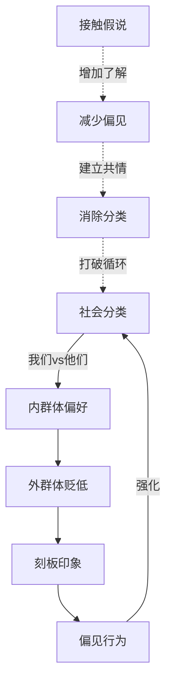

# 知识图谱图片描述 - 《社会心理学》

## 图一：社会心理学三大领域树状图

**类型：** tree graph
**用途：** 展示社会心理学的三大核心领域及其细分主题

**视觉说明：** 顶部根节点"社会心理学"，向下分三大领域（社会思维/社会影响/社会关系），每领域再分三个子主题。整体倒树形结构。配色建议：根节点深蓝，三大领域用蓝/绿/紫，子节点用对应浅色调。

---

## 图二：从众到极端化的路径图

**类型：** path/flow diagram
**用途：** 呈现个体如何在群体影响下逐步走向极端化的过程

**视觉说明：** 从左到右的线性流程，带有两个反馈回路（虚线箭头）。前半段用蓝色调，"群体极化"后转为红色调表示危险。反馈回路用灰色虚线。

---

## 图三：情境力量网络图

**类型：** network/relationship graph
**用途：** 展示情境因素如何影响个体行为的复杂网络

**视觉说明：** 左侧"社会情境"为起点，通过三个中间因素（角色/规范/权威）影响行为，最终形成长期模式。实线表示直接影响，虚线表示间接影响。节点大小按影响力区分。

---

## 图四：偏见形成与消除循环图

**类型：** cycle diagram
**用途：** 呈现偏见的形成机制和消除路径

**视觉说明：** 上方为偏见形成的恶性循环（红色调），下方为消除偏见的正向路径（绿色调）。实线箭头表示恶性循环，虚线箭头表示打破循环的干预路径。
