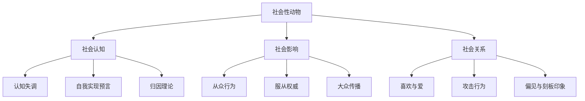
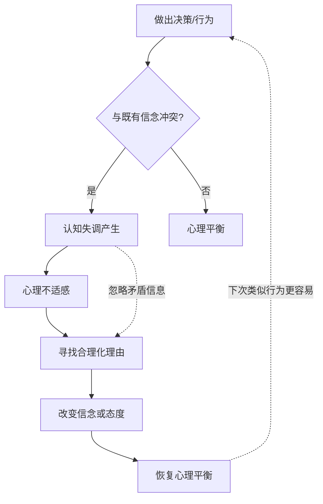
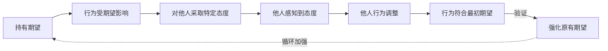
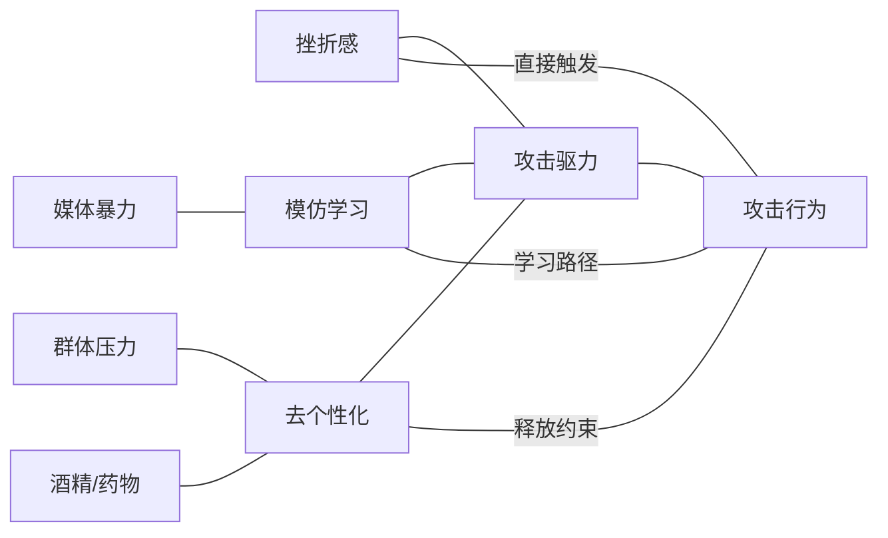

# 知识图谱图片描述 - 《社会性动物》

## 图一：社会性动物核心主题树状图

**类型：** tree graph
**用途：** 展示阿伦森提出的社会心理学核心主题体系

**视觉说明：** 顶部根节点"社会性动物"，向下分三大主题（社会认知/社会影响/社会关系），每主题再分三个子领域。倒树形结构。配色建议：根节点深紫，三大主题用紫/蓝/绿，子节点用对应浅色调。

---

## 图二：认知失调循环图

**类型：** cycle diagram
**用途：** 呈现认知失调的产生、缓解与强化循环

**视觉说明：** 认知失调的产生路径用红色调，心理平衡路径用绿色调。主循环箭头顺时针，两个反馈回路用虚线表示。节点大小按重要性区分，"认知失调产生"和"寻找合理化理由"为较大节点。

---

## 图三：自我实现预言路径图

**类型：** path/flow diagram
**用途：** 展示期望如何通过行为反馈塑造现实

**视觉说明：** 从左到右的线性流程，带有反馈回路。前半段用蓝色调，"行为符合最初期望"后转为紫色调。反馈回路用虚线箭头，标注"循环加强"。

---

## 图四：攻击行为影响因素网络图

**类型：** network/relationship graph
**用途：** 展示导致攻击行为的多因素交互网络

**视觉说明：** 左侧三个主要因素（挫折/模仿/去个性化）通过"攻击驱力"汇聚，最终导致"攻击行为"。外围因素（媒体/群体/药物）影响主要因素。连线粗细表示影响强度，节点颜色按因素类型区分。
