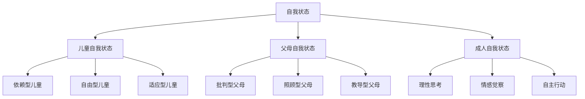
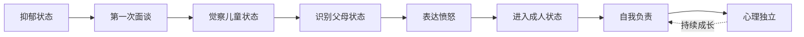
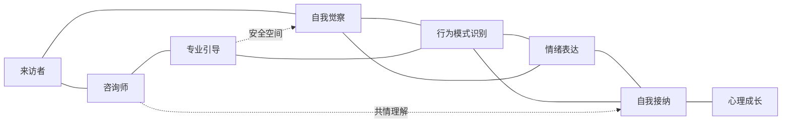
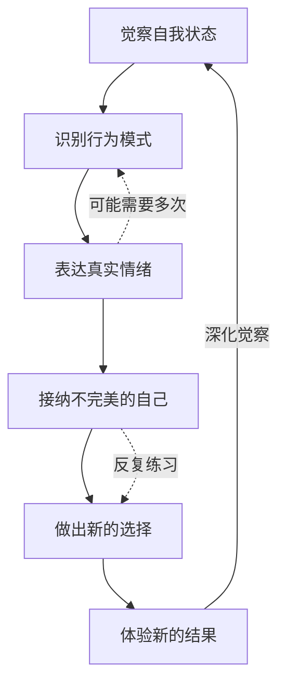

# 知识图谱图片描述 - 《蛤蟆先生去看心理医生》

## 图一：三种自我状态树状图

**类型：** tree graph
**用途：** 展示沟通分析理论中的三种自我状态及其典型行为

**视觉说明：** 顶部根节点"自我状态"，向下分三种状态，每种再分三个子类型。倒树形结构。配色建议：根节点深蓝，儿童状态用橙色，父母状态用红色，成人状态用绿色，子节点用对应浅色调。

---

## 图二：蛤蟆先生成长路径图

**类型：** path/flow diagram
**用途：** 呈现蛤蟆先生从依赖到独立的心理成长过程

**视觉说明：** 从左到右的线性成长路径。前半段（抑郁到觉察）用灰色调，中间（识别到愤怒）用橙色调，后半段（成人到独立）用绿色调。虚线箭头表示持续成长的过程。

---

## 图三：心理咨询过程网络图

**类型：** network/relationship graph
**用途：** 展示心理咨询中的关键要素及其关系

**视觉说明：** 左侧为来访者和咨询师，中间为核心过程要素，右侧为成长结果。实线表示直接关系，虚线表示支持性关系。节点按流程阶段着色。

---

## 图四：心理疗愈循环图

**类型：** cycle diagram
**用途：** 呈现心理疗愈的循环迭代过程

**视觉说明：** 顺时针循环结构。六个核心步骤均匀分布成圆形。实线箭头表示主循环，虚线箭头表示反馈强化。配色建议：渐变色环（蓝→绿→青→蓝），表示持续迭代。
