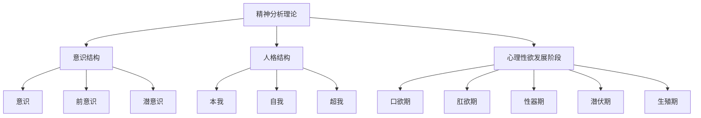
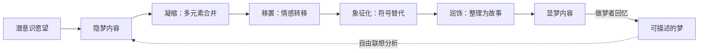
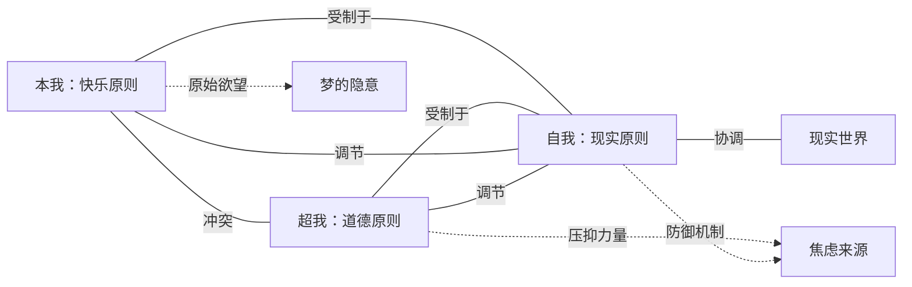
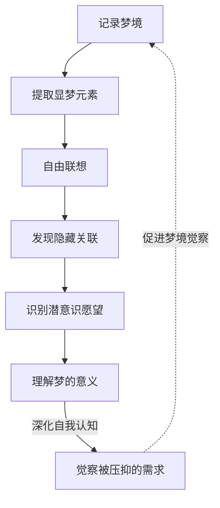

# 知识图谱图片描述 - 《梦的解析》

## 图一：精神分析理论体系树状图

**类型：** tree graph
**用途：** 展示弗洛伊德精神分析理论的核心结构

**视觉说明：** 顶部根节点"精神分析理论"，向下分三大体系（意识结构/人格结构/发展阶段），每体系再分对应子节点。倒树形结构。配色建议：根节点深紫，三大体系用紫/蓝/绿，子节点用对应浅色调。

---

## 图二：梦的工作机制路径图

**类型：** path/flow diagram
**用途：** 呈现从隐梦到显梦的加工过程

**视觉说明：** 从左到右的线性流程，展示隐梦经过四步加工变为显梦的过程。底部虚线箭头表示精神分析中通过自由联想从显梦回溯隐梦的路径。配色：潜意识端用紫色调，加工过程用蓝色调，显梦端用灰色调。

---

## 图三：人格结构网络图

**类型：** network/relationship graph
**用途：** 展示本我、自我、超我的动态关系

**视觉说明：** 中央为"自我"，左侧为"本我"，右侧为"超我"，底部为"现实世界"。实线表示相互作用关系，虚线表示与梦和焦虑的关联。节点用不同颜色区分，自我用绿色居中。

---

## 图四：梦的分析循环图

**类型：** cycle diagram
**用途：** 呈现通过自由联想分析梦的循环过程

**视觉说明：** 顺时针循环结构。七个步骤均匀分布成圆形。实线箭头表示分析流程，虚线箭头表示反馈强化。配色：渐变色环（紫→蓝→绿→紫），表示循环迭代和自我深化。
