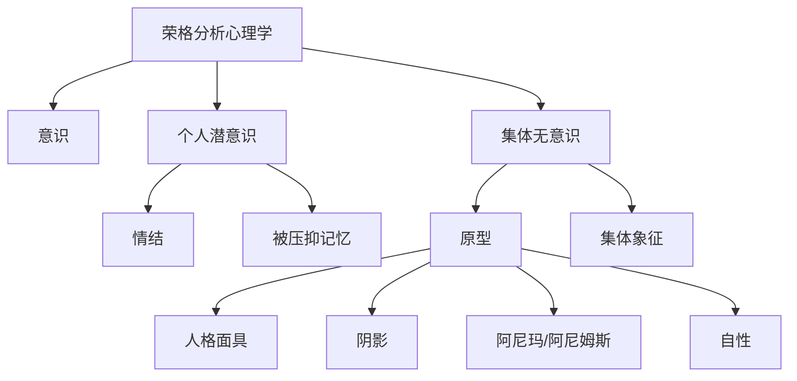
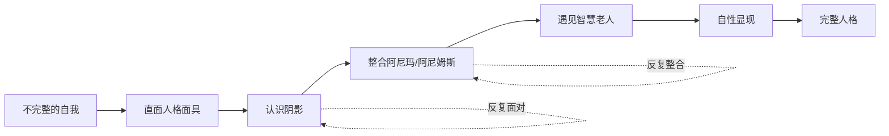
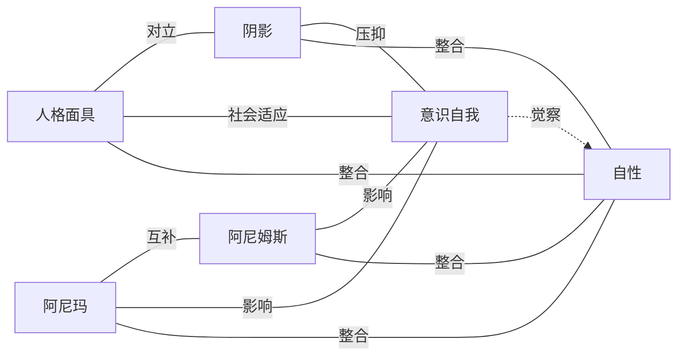
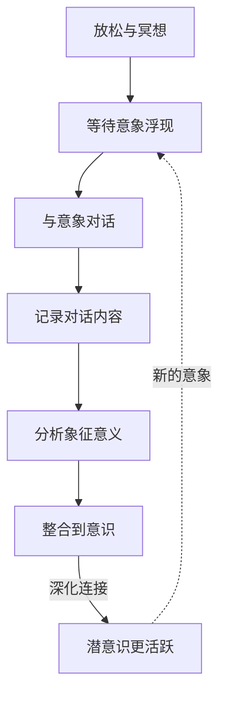

# 知识图谱图片描述 - 《红书》

## 图一：荣格心理学核心概念树状图

**类型：** tree graph
**用途：** 展示荣格分析心理学的核心理论体系

**视觉说明：** 顶部根节点"荣格分析心理学"，向下分三层心理结构（意识/个人潜意识/集体无意识），集体无意识再展开原型系统。倒树形结构。配色建议：根节点深蓝，意识层用浅蓝，个人潜意识用紫色，集体无意识用深紫，原型用金色。

---

## 图二：个体化过程路径图

**类型：** path/flow diagram
**用途：** 呈现荣格提出的个体化（走向完整）的心理发展路径

**视觉说明：** 从左到右的线性路径，带有两个反馈回路。每个阶段用不同颜色表示深化过程（浅蓝→紫→深紫→金）。反馈回路用虚线表示个体化过程的反复性。

---

## 图三：原型系统网络图

**类型：** network/relationship graph
**用途：** 展示四大原型之间的动态关系及其与意识的互动

**视觉说明：** 中央为"意识自我"和"自性"，周围分布四大原型。实线表示原型间关系，虚线表示整合方向。配色：人格面具用浅蓝，阴影用深灰，阿尼玛/阿尼姆斯用粉/蓝，自性用金色居中。

---

## 图四：潜意识探索循环图

**类型：** cycle diagram
**用途：** 呈现通过主动想象技术与潜意识对话的循环过程

**视觉说明：** 顺时针循环结构。七个步骤均匀分布成圆形。实线箭头表示主动想象的步骤流程，虚线箭头表示循环迭代。配色：渐变色环（蓝→紫→金→蓝），表示意识与潜意识的深度交融。
