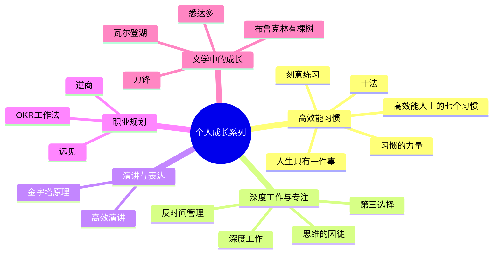
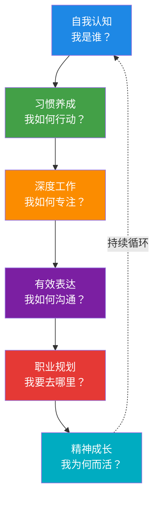
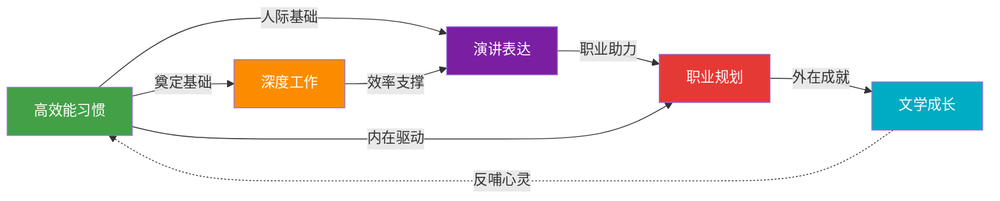
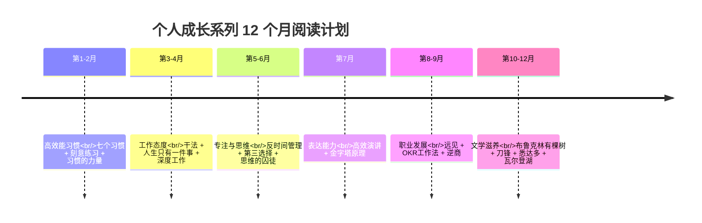

# 12-个人成长系列 | 视觉指南

> 本系列包含 18 本个人成长经典，覆盖高效能习惯、深度工作、演讲表达、职业规划与文学成长五大主题。

---

## 系列全景图

```mermaid
mindmap
  root((个人成长系列))
    高效能习惯
      高效能人士的七个习惯
      刻意练习
      习惯的力量
      干法
      人生只有一件事
    深度工作与专注
      深度工作
      反时间管理
      第三选择
      思维的囚徒
    演讲与表达
      高效演讲
      金字塔原理
    职业规划
      远见
      OKR工作法
      逆商
    文学中的成长
      布鲁克林有棵树
      刀锋
      悉达多
      瓦尔登湖
```

---

## 成长路径图

```mermaid
graph TD
    A["自我认知<br/>我是谁？"] --> B["习惯养成<br/>我如何行动？"]
    B --> C["深度工作<br/>我如何专注？"]
    C --> D["有效表达<br/>我如何沟通？"]
    D --> E["职业规划<br/>我要去哪里？"]
    E --> F["精神成长<br/>我为何而活？"]
    F -. 持续循环 .-> A
    
    style A fill:#1E88E5,color:#fff
    style B fill:#43A047,color:#fff
    style C fill:#FB8C00,color:#fff
    style D fill:#7B1FA2,color:#fff
    style E fill:#E53935,color:#fff
    style F fill:#00ACC1,color:#fff
```

---

## 书籍关联图

```mermaid
graph LR
    A["高效能习惯"] -->|"奠定基础"| B["深度工作"]
    A -->|"人际基础"| C["演讲表达"]
    B -->|"效率支撑"| C
    C -->|"职业助力"| D["职业规划"]
    A -->|"内在驱动"| D
    D -->|"外在成就"| E["文学成长"]
    E -. 反哺心灵 .-> A
    
    style A fill:#43A047,color:#fff
    style B fill:#FB8C00,color:#fff
    style C fill:#7B1FA2,color:#fff
    style D fill:#E53935,color:#fff
    style E fill:#00ACC1,color:#fff
```

---

## 阅读顺序建议

```mermaid
timeline
    title 个人成长系列 12 个月阅读计划
    第1-2月 : 高效能习惯<br/>七个习惯 + 刻意练习 + 习惯的力量
    第3-4月 : 工作态度<br/>干法 + 人生只有一件事 + 深度工作
    第5-6月 : 专注与思维<br/>反时间管理 + 第三选择 + 思维的囚徒
    第7月 : 表达能力<br/>高效演讲 + 金字塔原理
    第8-9月 : 职业发展<br/>远见 + OKR工作法 + 逆商
    第10-12月 : 文学滋养<br/>布鲁克林有棵树 + 刀锋 + 悉达多 + 瓦尔登湖
```

---

<strong>提示</strong>：成长类书籍最重要的是"知行合一"，每读完一本至少落实一个行动改变。

