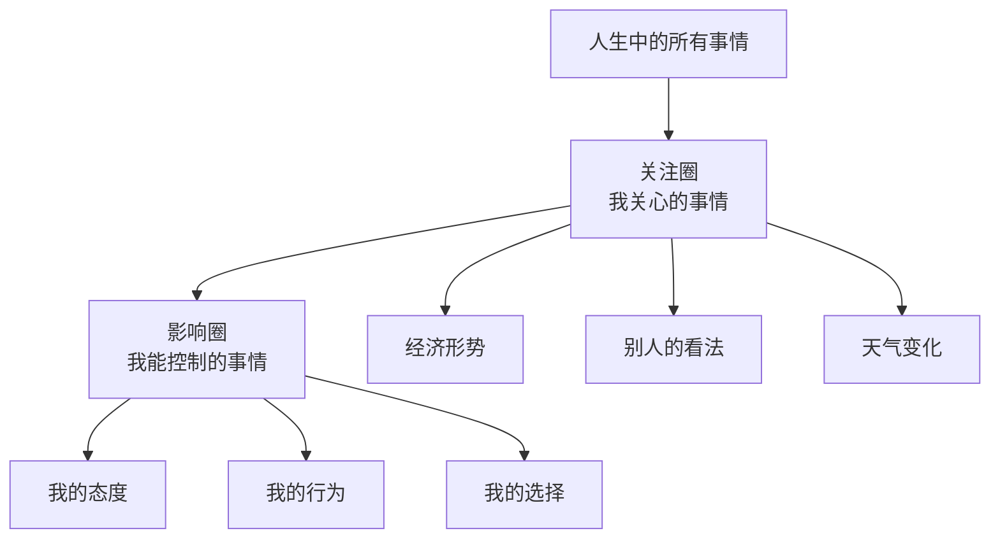

# 01 | 积极主动：选择的自由

> "在刺激和回应之间，有一个人可以选择的空间。"

  习惯一

---

## 你是积极主动的人吗？

想想这些场景：

**消极被动的反应：**
- "我没办法改变现状"
- "这就是我的性格，改不了"
- "老板太不讲理了，我只能忍受"
- "天气不好，我的心情也跟着糟糕"

**积极主动的反应：**
- "虽然环境困难，但我可以选择如何应对"
- "我可以学习新技能来提升自己"
- "我可以主动和老板沟通，寻找解决方案"
- "天气不好，但我可以调整自己的心情"

**区别在哪里？** 积极主动的人知道：**在任何刺激和回应之间，我们有选择的自由。**

---

## 核心概念：关注圈 vs 影响圈

**消极被动的人**：
- 精力集中在关注圈
- 抱怨自己无法改变的事情
- 影响圈越来越小
- 感觉越来越无力

**积极主动的人**：
- 专注于影响圈
- 把精力放在能改变的事情上
- 影响圈逐渐扩大
- 获得更多掌控感

---

## 语言的力量

你的语言暴露了你的思维模式：

| 消极被动语言 | 积极主动语言 |
|:---|:---|
| "我不得不..." | "我选择..." |
| "我没办法" | "让我想想有没有其他方法" |
| "他让我生气" | "我选择如何应对他的行为" |
| "我只能这样" | "我可以尝试不同的方式" |
| "这不可能" | "这有挑战性，但我可以试试" |

**练习**：接下来一周，留意自己说的话，把消极语言替换为积极语言。

---

## 如何在日常生活中实践？

### ◇ 面对工作挫折

**情境**：项目被领导否决了。

**消极反应**："领导不懂我的想法，我真倒霉。"

**积极反应**："我可以主动约领导聊聊，了解他的顾虑，调整方案再提交。"

### ◇ 面对人际关系

**情境**：同事对你态度冷淡。

**消极反应**："他肯定对我不满，我也懒得理他。"

**积极反应**："我可以主动关心他，问问是否需要帮助。"

### ◇ 面对个人成长

**情境**：想学新技能但没时间。

**消极反应**："工作太忙了，哪有时间学习。"

**积极反应**："每天抽出 30 分钟，坚持一个月就能看到进步。"

---

## 行动清单

1. **暂停练习**：遇到刺激时，暂停 3 秒再回应
2. **语言转换**：用"我选择"替代"我必须"
3. **影响圈清单**：写下今天能做的 3 件有意义的事
4. **不抱怨一天**：尝试 24 小时不抱怨任何事
5. **主动出击**：今天主动解决一个拖延已久的问题

---

<strong>明日习惯</strong>：以终为始 —— 开始时就明确方向

