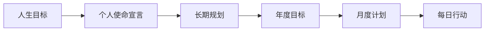

# 02 | 以终为始 + 要事第一：人生的导航系统

> "如果你不知道要去哪里，任何路标都没有意义。"

<div align="center" style="margin: 15px 0;">
  <span style="display:inline-block; padding: 8px 20px; background: #43A047; color: #fff; border-radius: 20px; font-size: 14px;">习惯二 & 习惯三</span>
</div>

---

## 习惯二：以终为始

### ◇ 两次创造

任何事物都经过两次创造：
1. **第一次创造**：在头脑中构思（心智创造）
2. **第二次创造**：在现实中实现（物理创造）

盖房子先有蓝图，写代码先有设计，人生也需要先有规划。



### ◇ 撰写个人使命宣言

这是以终为始的核心工具。问自己几个问题：

- 我想成为什么样的人？
- 我想成就什么样的事业？
- 我想给身边的人带来什么影响？
- 在我离开这个世界时，我希望别人如何评价我？

**使命宣言示例**：
> "我要做一个有原则、有爱心、有创造力的人，用我的能力帮助他人成长，为团队创造价值，为家庭带来温暖。"

---

## 习惯三：要事第一

### ◇ 时间管理四象限

```
                紧急              不紧急
           ┌─────────────┬─────────────┐
      重要 │ 第一象限     │ 第二象限     │
           │ 危机         │ 规划         │
           │ 紧急问题     │ 预防         │
           │ 最后期限     │ 关系建立     │
           │              │ 自我提升     │
           ├─────────────┼─────────────┤
      不重要│ 第三象限     │ 第四象限     │
           │ 干扰         │ 琐事         │
           │ 某些邮件     │ 刷手机       │
           │ 某些会议     │ 无目的上网   │
           │              │ 浪费时间     │
           └─────────────┴─────────────┘
```

**高效能人士的秘密**：把时间花在**第二象限**（重要不紧急）。

- 第一象限：救火模式，压力山大
- 第二象限：投资未来，产生复利
- 第三象限：看似忙碌，实际无效
- 第四象限：纯粹浪费时间

### ◇ 每周规划法

柯维推荐使用**周**而不是日作为规划单位：

1. **确认角色**：列出你生活中的关键角色（父母、员工、朋友、学习者等）
2. **选择目标**：为每个角色选择 1-2 个本周最重要的目标
3. **安排时间**：先把重要事项排入日程，其他事情围绕它们安排
4. **每日调整**：根据实际情况灵活调整

---

## 常见陷阱

### ◇ 陷阱一：忙≠效能

很多人把"忙碌"等同于"高效"，但实际上：
- 你可能在高效地做错误的事情
- 你可能在应付紧急但不重要的事
- 真正重要的事往往不紧急，所以被无限推迟

### ◇ 陷阱二：没有使命宣言

没有个人使命宣言，就像航海没有指南针：
- 容易被外界期望左右
- 目标经常变化，缺乏一致性
- 短期行为与长期价值脱节

---

## 实践步骤

1. **本周**：写下你的个人使命宣言初稿
2. **下周**：尝试第一次周规划，记录感受
3. **一个月后**：回顾四象限时间分配，调整策略
4. **三个月后**：修订使命宣言，确保它仍然指引你

---

<div align="center" style="padding: 15px; background: #E8F5E9; border-radius: 8px;">
<strong>核心提醒</strong>：要事第一的"要事"，由"以终为始"的"终"来定义。
</div>
