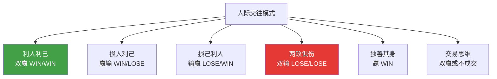
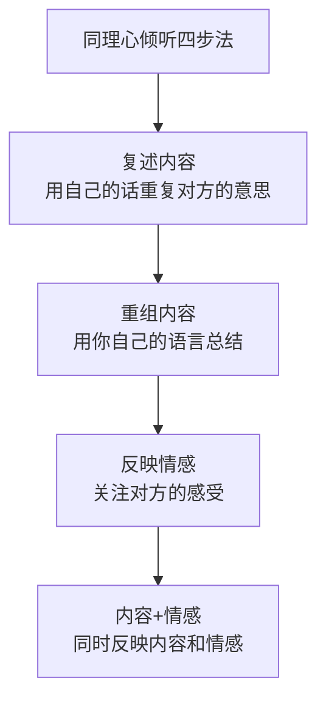
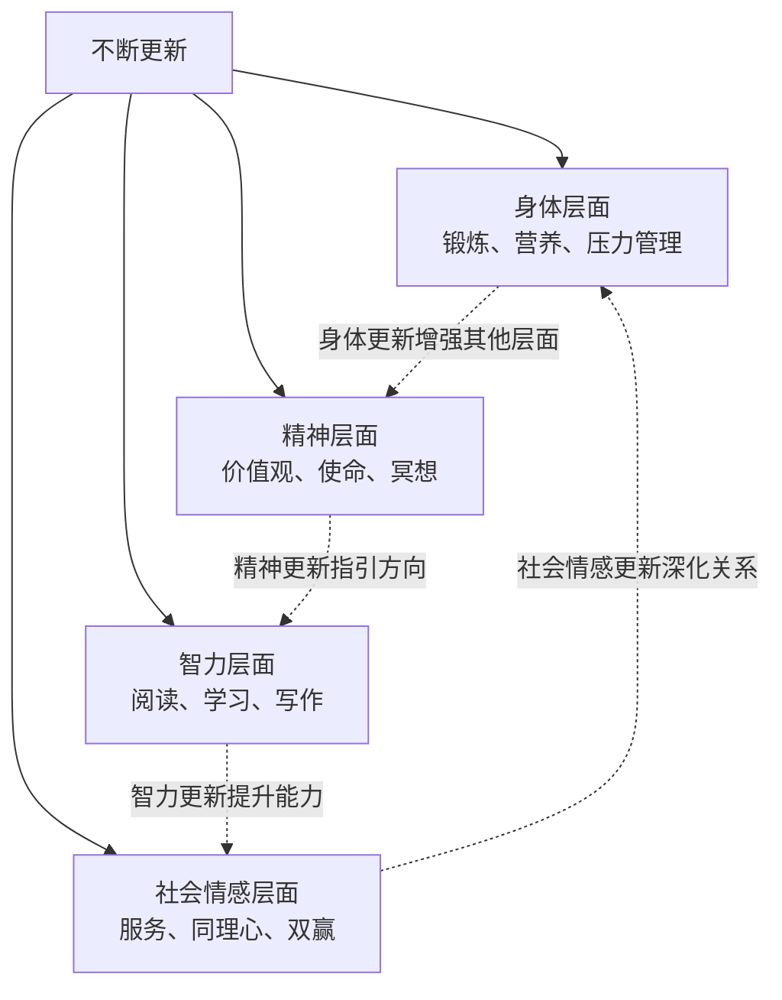
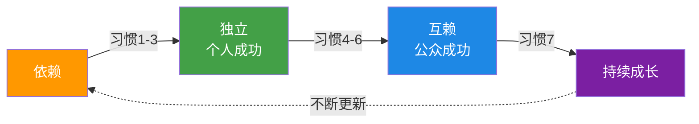

# 03 | 双赢思维 + 知彼解己 + 统合综效 + 不断更新

> "真正的效能，不仅是个人的成功，更是与他人合作创造的更大价值。"

  习惯四 ~ 习惯七

---

## 习惯四：双赢思维

### ◇ 人际交往的六种模式

**双赢思维的四个维度**：
1. **双赢品格**：真诚、成熟、富足心态（相信资源足够所有人分享）
2. **双赢协议**：明确期望、指导方针、可用资源、责任后果
3. **双赢体系**：奖励机制必须支持双赢行为
4. **双赢过程**：从对方角度看问题 → 识别关键问题 → 寻找可接受结果 → 找到实现路径

**关键洞察**：如果无法达成双赢，宁可选择"好聚好散"（No Deal）。

---

## 习惯五：知彼解己

### ◇ 同理心倾听

这是全书最重要的沟通技巧。**大多数人不是为了理解而倾听，而是为了回应而倾听。**

**倾听的五个层次**（从低到高）：
1. **忽视**：完全不听对方说话
2. **假装**：表面上在听，实际上心不在焉
3. **选择性**：只听自己感兴趣的部分
4. **专注**：专注于对方说的每一个字
5. **同理心**：站在对方角度，理解他们的情感和理智

**练习示例**：
- 对方："我最近工作压力太大了，感觉快撑不住了。"
- 回应："听起来你最近工作负担很重（内容），让你感到很焦虑和无助（情感），是吗？"

**先理解，再被理解**。这是沟通的黄金法则。

---

## 习惯六：统合综效

### ◇ 第三种选择

统合综效的核心是：**整体大于部分之和（1+1>2）**。

- 不是你的方法，也不是我的方法
- 而是**更好的第三种方法**

**实现统合综效的步骤**：
1. 面对问题或机会
2. 了解对方的观点（运用习惯五）
3. 表达自己的观点
4. 共同寻找新的、更好的解决方案

**珍视差异**：
- 差异不是障碍，而是资源
- 如果两个人想法完全一样，其中一个人就是多余的
- 真正的力量在于互补

---

## 习惯七：不断更新

### ◇ 四个层面的更新

**个人效能的飞轮**：
- 锻炼身体 → 精力充沛 → 更好学习 → 提升能力 → 更好服务他人 → 获得成就感 → 更有动力锻炼...

### ◇ 具体行动

| 层面 | 建议行动 | 频率 |
|:---:|------|:---:|
| 身体 | 有氧运动、力量训练、健康饮食 | 每周 3-5 次 |
| 精神 | 冥想、写日记、阅读经典、接触自然 | 每日/每周 |
| 智力 | 阅读专业书籍、学习新技能、写作输出 | 每周 |
| 社会情感 | 维护重要关系、帮助他人、团队合作 | 持续 |

---

## 七个习惯的内在逻辑

**成长路径**：
1. **依赖**：你需要为我的成功负责
2. **独立**：我为自己的成功负责
3. **互赖**：我们可以合作创造更大的成功

---

<strong>总结</strong>：七个习惯不是一套技巧，而是一个从内到外的成长系统。

