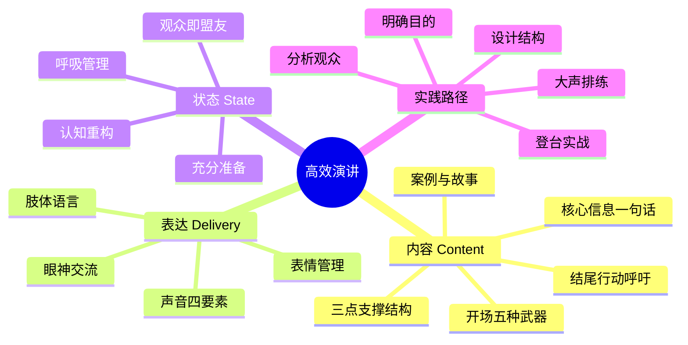
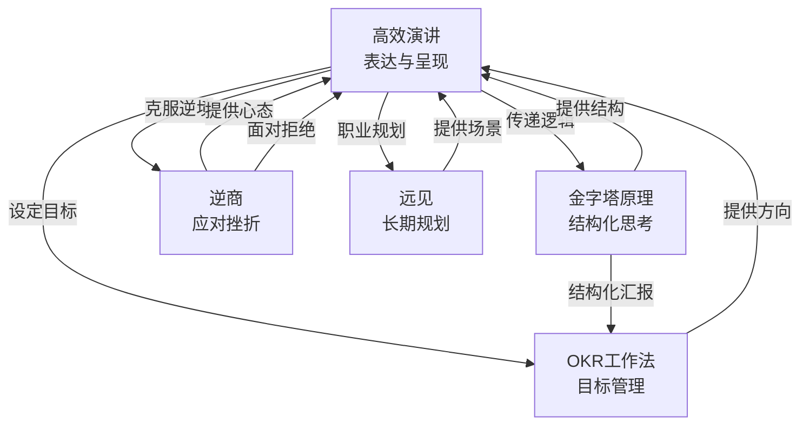
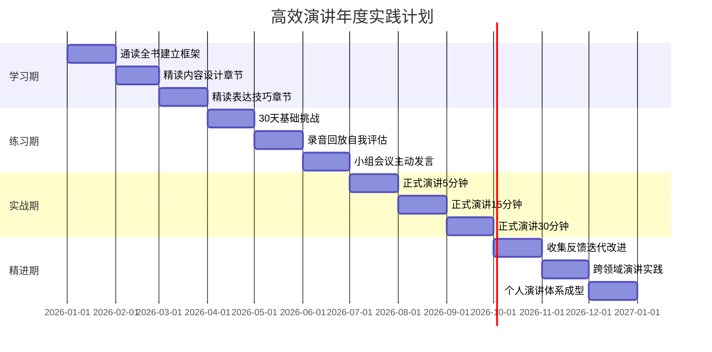

# ◇ 系列视觉指南：《高效演讲》阅读地图 ◆

本节提供《高效演讲》的完整视觉化学习路径，帮助读者快速把握全书脉络，并与其他书籍建立连接。

---

## 01 全书知识结构思维导图

---

## 02 演讲能力成长路径

### ◆ 各阶段学习重点

| 阶段 | 学习重点 | 核心练习 | 时间投入 |
|------|---------|---------|---------|
| 初学者 | 克服紧张、基础结构 | 每天大声朗读5分钟 | 30天 |
| 入门者 | 内容设计、观众分析 | 每周准备一次3分钟演讲 | 90天 |
| 进阶者 | 表达技巧、肢体语言 | 每月一次正式演讲并录像 | 180天 |
| 熟练者 | 个人风格、即兴演讲 | 主动寻找各种演讲机会 | 1年+ |

---

## 03 与系列其他书籍的关系图

---

## 04 12个月阅读与实践时间线

---

## 05 阅读顺序建议

### ◆ 推荐阅读流程

**第一遍：快速通读（1-2天）**——不要做笔记，不要停下来思考，一口气读完。目标是建立全局框架感，知道这本书在讲什么。

**第二遍：精读核心章节（1周）**——重点阅读内容设计、表达技巧、状态管理三个章节。每个章节读完立即做一个练习。

**第三遍：对照实践（持续）**——每次演讲前翻阅相关章节，演讲后对照自评框架打分。

### ◆ 与系列其他书的阅读顺序

1. 先读《金字塔原理》建立结构化思维能力
2. 再读《高效演讲》学习如何把结构化的内容有效传递出去
3. 配合《逆商》克服演讲中的紧张和恐惧
4. 用《OKR工作法》为你的演讲能力提升设定目标
5. 用《远见》规划你在职场中运用演讲能力的长期路径

---

◇ 关注"人类文明经典阅读计划"，每月共读一本好书 ◆
