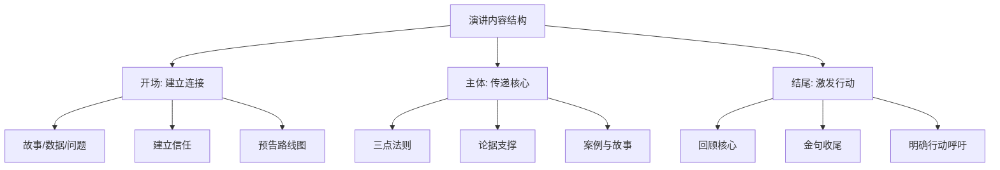

# ◇ 02 核心内容A：内容设计——演讲的骨架与灵魂 ◆

演讲的内容决定了你的价值上限。再好的表达技巧，也无法拯救空洞无物的内容。本节深入讲解如何打造有说服力的演讲内容。

---

## 01 内容设计的三大支柱

### ● 支柱一：以观众为中心

传统演讲者的错误起点是"我想说什么"。高效演讲者的起点永远是"观众需要听什么"。

在准备阶段，回答以下问题：
- 观众是谁？他们的背景、职级、专业程度如何？
- 他们为什么坐在这里？是被迫的还是自愿的？
- 他们最大的痛点是什么？
- 演讲结束后，你希望他们做什么？

### ● 支柱二：单一核心信息

一场演讲只能有一个核心信息。所有其他内容都服务于这个信息。

如果你无法用一句话说清楚你想表达什么，说明你自己还没想清楚。

### ● 支柱三：结构即力量

人类大脑天然偏好结构化的信息。没有结构的内容就像没有骨架的身体——瘫软无力。

---

## 02 开场设计的五种武器

开场的前三分钟决定了整场演讲的走向。以下是五种最有效的开场方式：

### ◆ 武器一：震撼数据

"全球每年有800万吨塑料流入海洋，相当于每分钟往海里倒一整辆垃圾车的塑料。"

数据的力量在于打破观众的舒适区，让他们意识到问题的严重性。

### ◆ 武器二：个人故事

"三年前，我站在一个和我今天一样的讲台上，双腿发抖，声音发颤。但今天我学会了……"

故事的力量在于建立情感连接。观众会因为这个故事而愿意听下去。

### ◆ 武器三：挑衅问题

"如果我告诉你，你现在做事的方式至少有50%是浪费时间，你愿意听我说下去吗？"

问题的力量在于激活观众的大脑。一旦大脑被激活，注意力就自然集中。

### ◆ 武器四：反直觉观点

"大多数人认为好演讲需要天赋，但科学研究证明这是错的。"

反直觉的力量在于制造认知冲突，观众会好奇"那真相是什么"。

### ◆ 武器五：沉默的力量

走上讲台，站定，环视全场，沉默五秒。

沉默的力量在于打破预期，创造一种"有大事要发生"的氛围。

---

## 03 场景示例

**场景一：产品发布会**

错误开场："大家好，我是张三，今天给大家介绍我们的新产品。"

正确开场："去年，有300万用户因为一个共同的问题失眠了。今天，我们带来了答案。"

**场景二：年终汇报**

错误开场："各位领导好，下面我来汇报一下今年的工作。"

正确开场："今年我们团队做了一件事，让部门效率提升了40%。接下来三分钟我告诉你是怎么做的。"

---

## 04 行动清单

完成以下内容设计检查，你的演讲骨架就已经成型：

□ 用一句话说清楚演讲的核心信息

□ 列出观众的三个核心痛点

□ 设计一个能让观众在30秒内产生兴趣的开场

□ 确定主体的三个支撑论点

□ 为每个论点准备至少一个案例或数据

□ 设计一个让人记住的结尾金句

□ 明确演讲结束后的行动呼吁

□ 通读整个内容，删除与核心信息无关的一切

---

下一节：◆ 03 核心内容B——表达技巧与状态管理
