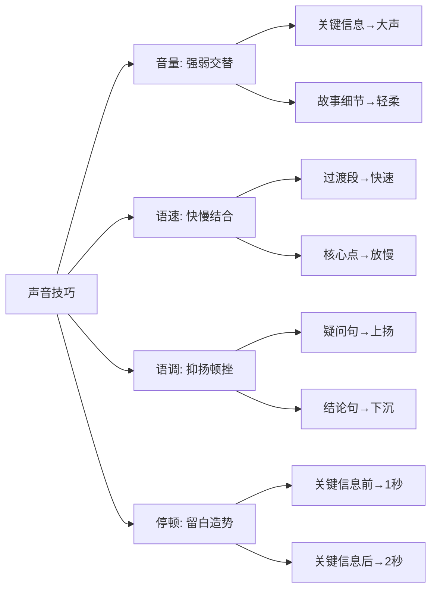
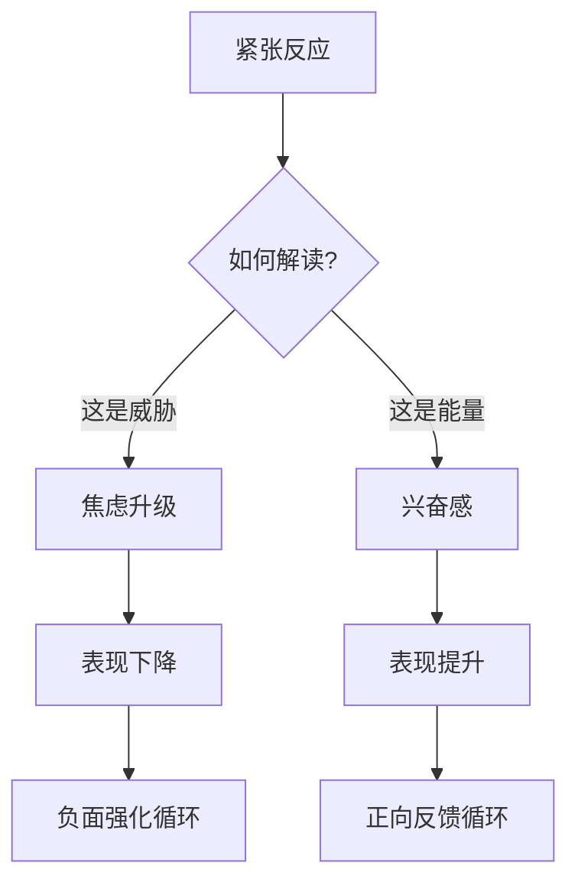

# ◇ 03 核心内容B：表达与状态——让内容活起来 ◆

内容是你的武器，表达是你的招式，状态是你的内功。本节深入讲解表达技巧和状态管理。

---

## 01 表达的四个维度

### ● 声音的力量

声音是演讲者最重要的工具。同一个句子，用不同的语调说出来，效果截然不同。

**音量控制**：重要内容提高音量，感性内容降低音量。音量变化比内容变化更能吸引注意力。

**语速变化**：关键信息放慢速度，过渡内容加快速度。变化的节奏本身就是吸引力。

**停顿的艺术**：最重要的技巧是停顿。在关键信息前停顿一秒，在关键信息后停顿两秒。沉默比语言更有力量。

### ● 肢体的语言

研究表明，观众对你信息的理解，55%来自肢体语言，38%来自声音，只有7%来自你说的话。

**站姿**：双脚与肩同宽，重心均匀分布。不要晃动，不要摇摆。稳定的身体传递稳定的信息。

**手势**：手势应该在腰部以上、肩部以下的"力量区域"。避免双手插兜、交叉抱臂、手指观众。

**移动**：有目的地移动。从论点一走到论点二的过程中完成话题转换。不要漫无目的地走来走去。

### ● 眼神的交流

与观众进行眼神交流是建立信任的最快方式。

**规则**：在一个完整的句子里看着一个人。不要扫视，不要飘过。用完整的眼神接触建立真实的连接。

**覆盖**：确保照顾到全场的观众。左边、中间、右边都要照顾到。

### ● 表情的管理

你的表情是观众情绪的镜子。如果你在微笑，观众会感到温暖。如果你严肃，观众会认真对待。

关键原则：**表情与内容一致**。讲轻松的故事时微笑，讲严肃的话题时收敛。

---

## 02 状态管理：与紧张做朋友

### ◆ 紧张的真相

紧张不是你的敌人。紧张是你身体在说"这件事很重要，我要帮你准备好"。

研究表明，适度的紧张能让表现提升30%。问题不在于紧张，而在于你如何解读紧张。

### ◆ CORE状态管理法

**C（Control 控制感）**：你能控制什么？你能控制准备程度、练习次数、呼吸节奏。把注意力放在你能控制的事情上。

**O（Ownership 担当力）**：这场演讲是你的责任，但观众是你的盟友。他们希望你成功，不是来挑错的。

**R（Reach 影响度）**：最坏的结果是什么？通常是"讲得不够好"，而不是"世界末日"。缩小逆境的影响范围。

**E（Endurance 持续性）**：紧张会持续多久？通常只在开场三分钟。过了这个坎，身体会自然适应。

---

## 03 对比表：高效演讲者 vs 普通演讲者

| 维度 | 普通演讲者 | 高效演讲者 |
|------|-----------|-----------|
| 准备焦点 | 背稿子、练手势 | 理解观众、设计结构 |
| 开场方式 | "大家好，我是..." | 故事/数据/问题 |
| 紧张处理 | 试图消灭紧张 | 重新定义为兴奋 |
| 观众视角 | 观众是裁判 | 观众是盟友 |
| 内容结构 | 按自己想到的顺序 | 按观众需要的顺序 |
| 结尾方式 | "谢谢，有问题吗" | 明确的行动呼吁 |
| 练习方式 | 默读 | 大声、站立、模拟真实场景 |

---

## 04 常见陷阱

### ◆ 陷阱一：过度准备

把演讲稿背得滚瓜烂熟，一旦被打断就完全崩溃。记住要点即可，让语言自然流淌。

### ◆ 陷阱二：信息过载

试图在一场演讲里塞进太多内容。观众记不住。一场演讲一个核心信息，三个支撑论点，足够。

### ◆ 陷阱三：忽视排练

在脑子里过一遍就算练习了。真正有效的练习是站起来、大声说出来、模拟真实场景。

### ◆ 陷阱四：读PPT

观众识字，不需要你读给他们听。PPT是视觉辅助，不是演讲稿。

### ◆ 陷阱五：忽视时间

超时是最不尊重观众的行为之一。宁可提前两分钟结束，绝不要超时一分钟。

---

下一节：◆ 04 核心内容C——综合框架与跨书连接
