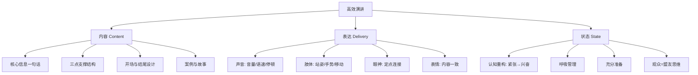

# ◇ 04 核心内容C：高效演讲的完整框架与跨书连接 ◆

本节将演讲的三要素整合为可操作的完整框架，并与系列中其他书籍建立连接。

---

## 01 演讲三要素完整框架

高效的演讲是内容、表达、状态三者的协同。任何一个短板都会限制整体效果。



### ◆ 准备流程全景图


---

## 02 与《金字塔原理》的连接

《高效演讲》的内容设计与《金字塔原理》的SCQA框架高度互补。

在演讲开场部分，使用SCQA结构可以瞬间抓住观众注意力：

**S（Situation 情境）**：描述观众熟悉的背景
**C（Complication 冲突）**：指出存在的问题或变化
**Q（Question 疑问）**：引出核心问题
**A（Answer 回答）**：给出你的核心信息——也就是演讲的起点

### ◆ 示例：用SCQA设计演讲开场

S："我们团队今年完成了12个产品迭代。"
C："但用户满意度反而下降了15%。"
Q："问题出在哪里？"
A："答案是：我们做的太多，想的太少。接下来，我来分享如何聚焦真正重要的事。"

---

## 03 与《逆商》的连接

演讲者的状态管理本质上是逆商（AQ）的应用。登台前的紧张是一种典型的"逆境"，攀登者型演讲者会用CORE四维度来处理：

**控制感**：我能控制我的准备和练习
**担当力**：我有责任把有价值的信息传递给观众
**影响度**：即使讲砸了，也不会影响我的整个人生
**持续性**：紧张只在开场几分钟，之后会自然消退

---

## 04 演讲类型速查表

| 演讲类型 | 核心目标 | 内容重点 | 表达重点 | 时长 |
|---------|---------|---------|---------|-----|
| 信息型 | 让观众了解 | 事实、数据、流程 | 清晰、条理 | 15-30分钟 |
| 说服型 | 让观众相信 | 论据、案例、逻辑 | 自信、激情 | 20-45分钟 |
| 激励型 | 让观众行动 | 故事、愿景、情感 | 感染力、真诚 | 10-20分钟 |
| 教学型 | 让观众学会 | 步骤、练习、反馈 | 耐心、互动 | 30-90分钟 |

---

## 05 自我评估框架

每次演讲后用以下框架自评，持续改进：

```mermaid
radarChart
    title "演讲能力雷达图"
    axis "内容结构", "故事运用", "声音变化", "肢体语言", "眼神交流", "状态管理"
    axis2 "开场吸引", "结尾有力", "时间控制", "观众互动"
```

评分标准：1-5分。每月评估一次，追踪进步轨迹。

---

下一节：◆ 05 结尾与30天挑战计划
