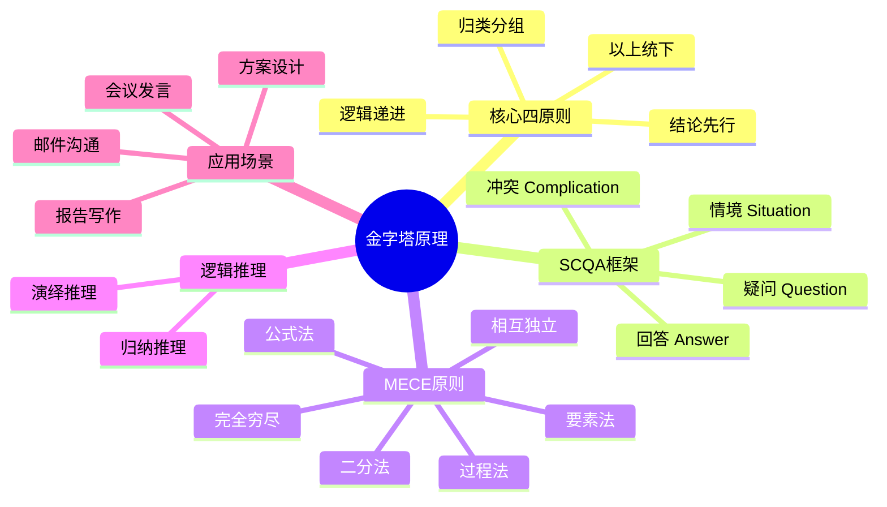
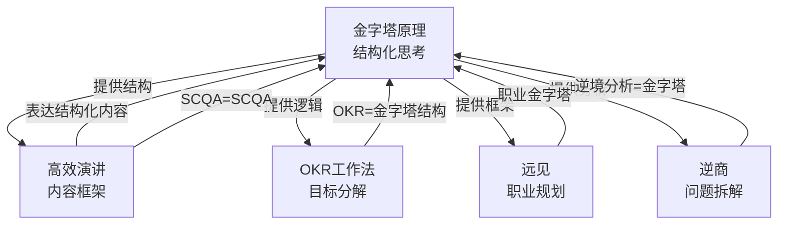
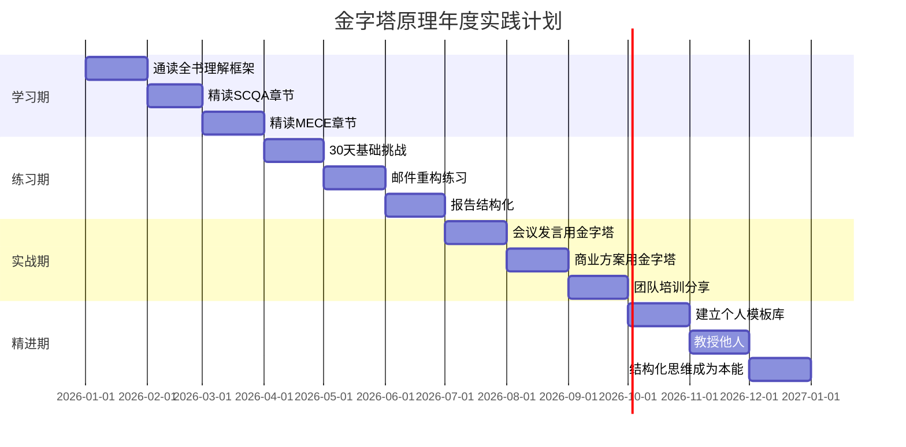

# ◇ 系列视觉指南：《金字塔原理》阅读地图 ◆

本节提供《金字塔原理》的完整视觉化学习路径，帮助读者快速把握全书脉络，并与其他书籍建立连接。

---

## 01 全书知识结构思维导图

---

## 02 结构化思维能力成长路径

### ◆ 各阶段学习重点

| 阶段 | 学习重点 | 核心练习 | 时间投入 |
|------|---------|---------|---------|
| 混沌期 | 认识结构的重要性 | 每天拆解一篇文章的结构 | 30天 |
| 觉醒期 | 掌握金字塔四原则 | 每周用金字塔结构写一份文档 | 90天 |
| 掌握期 | 熟练运用SCQA和MECE | 在会议发言中实践金字塔 | 180天 |
| 精通期 | 灵活切换演绎与归纳 | 跨场景应用写作方法 | 1年+ |

---

## 03 与系列其他书籍的关系图

---

## 04 12个月阅读与实践时间线

---

## 05 阅读顺序建议

### ◆ 推荐阅读流程

**第一遍：快速通读（2-3天）**——重点理解"结论先行"这一个概念。其他内容可以后续深入。

**第二遍：精读核心章节（2周）**——重点掌握SCQA框架和MECE原则。每个章节读完后立刻找一个真实文档练习。

**第三遍：持续应用（长期）**——把金字塔自检清单打印出来贴在工位上。每次写重要文档前看一眼。

### ◆ 与系列其他书的阅读顺序

1. 先读《金字塔原理》建立结构化思考能力（这是一切表达的基础）
2. 再读《高效演讲》学习如何把结构化的内容生动地传递出去
3. 用《OKR工作法》把结构化思维应用到目标管理中
4. 用《远见》做45年职业规划时运用金字塔结构
5. 遇到挫折时用《逆商》的心态结合金字塔原理快速分析问题

---

◇ 关注"人类文明经典阅读计划"，每月共读一本好书 ◆
