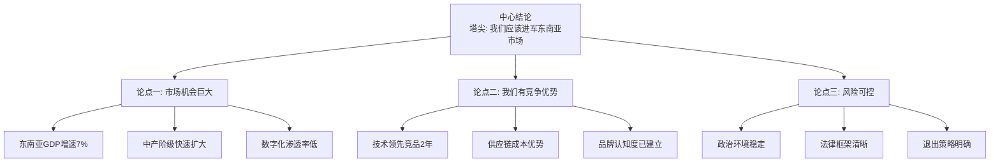
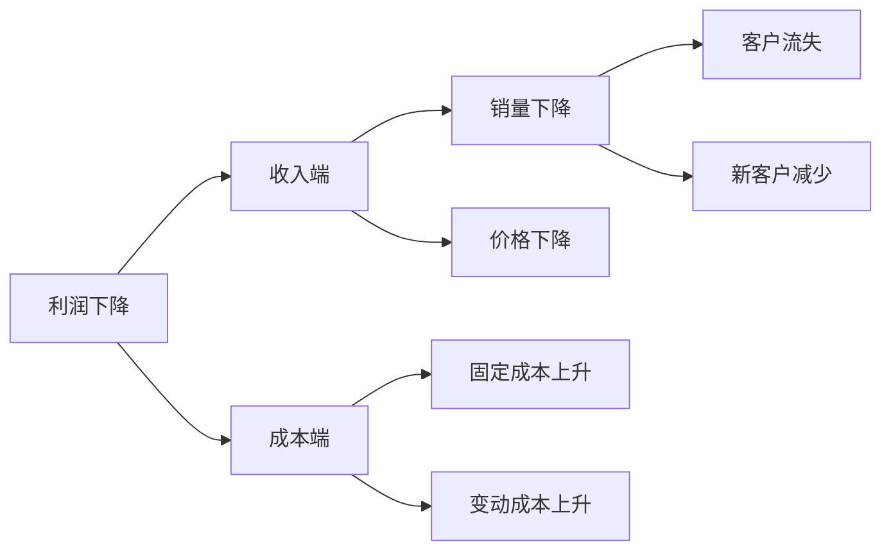

# ◇ 02 核心内容A：金字塔结构与MECE原则 ◆

本节深入讲解金字塔原理的两大基石：金字塔结构和MECE分类原则。这是所有结构化思考的基础。

---

## 01 金字塔的构造

金字塔结构的核心思想是：任何复杂的信息都可以被组织成层次分明的结构。塔尖是中心结论，向下逐层展开为支撑论点和具体证据。

### ● 为什么是金字塔？

人类短期记忆只能同时处理4±1个信息单元。如果你的内容超过这个数量，大脑就会超载。

金字塔结构通过分层分组，让每一层的信息量都在大脑的处理能力之内。读者可以在每一层消化3-5个要点，然后自然过渡到下一层。

### ● 金字塔的构建顺序

自上而下法：先确定塔尖结论，然后逐层向下展开支撑论点。适合你已经知道结论、需要组织论证的情况。

自下而上法：先列出所有具体事实和发现，然后向上归纳总结出论点，最终得出中心结论。适合你还在探索阶段、尚未确定结论的情况。

---

## 02 MECE原则深度解析

MECE是Mutually Exclusive（相互独立）和Collectively Exhaustive（完全穷尽）的缩写。

### ◆ MECE的核心价值

分类不重叠：每个数据只能被归入一个类别。如果客户既在A类又在B类，说明分类有问题。

分类不遗漏：所有可能性都被覆盖。如果你只分析了线上渠道却忘了线下，结论就会偏差。

### ◆ 常见的MECE分类框架

**二分法**：内部/外部、主观/客观、收入/支出、短期/长期。最简单但有时过于粗糙。

**过程法**：按时间顺序或流程步骤分类。如"研发-生产-销售-售后"。适合流程分析。

**要素法**：按组成要素分类。如营销的4P（产品、价格、渠道、推广）。适合拆解复杂事物。

**公式法**：按数学公式拆解。如"利润=收入-成本"。最严谨，因为公式天然MECE。

---

## 03 场景示例

**场景一：年终汇报**

错误做法：按时间顺序罗列全年做过的所有事情。

正确做法：用金字塔结构——"今年我们达成了三个核心成果：业绩增长40%、团队建设完成、流程效率提升30%"。然后每个成果用2-3个数据支撑。

**场景二：项目方案**

错误做法：从背景介绍开始，讲到问题分析，最后才说出你的建议。

正确做法：开篇直接说建议——"建议采用方案B"。然后用三个MECE维度说明为什么：成本最低、实施最快、风险最小。

---

## 04 行动清单

□ 选定一个你近期要写的报告或方案

□ 用一句话说清楚你的中心结论（塔尖）

□ 列出3-5个支撑论点，检查MECE

□ 为每个论点找到至少两个具体证据

□ 用SCQA框架重写你的开篇段落

□ 删除所有不直接支撑塔尖的内容

□ 请同事阅读并反馈：能否在30秒内抓住核心信息？

---

下一节：◆ 03 核心内容B——SCQA框架与逻辑推理
