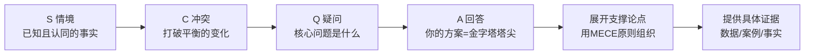

# ◇ 03 核心内容B：SCQA框架与逻辑推理 ◆

SCQA是金字塔原理中最强大的开场工具，配合演绎和归纳两种推理方式，让你的表达既有吸引力又有说服力。

---

## 01 SCQA故事框架

SCQA框架是芭芭拉·明托对"如何写一个让人无法拒绝的开头"的回答。它的精髓是：先让观众点头（情境），再让他们紧张（冲突），然后制造好奇（疑问），最后给出答案（回答）。

### ◆ 四步结构详解

**S（Situation 情境）**：描述观众已经知道、且认同的事实。目的是让观众点头——"是的，确实如此"。

**C（Complication 冲突）**：指出变化、问题或挑战。打破情境中的平衡，制造紧张感。

**Q（Question 疑问）**：从冲突中自然引出的核心问题。这个问题应该是观众也在心里问的。

**A（Answer 回答）**：你的方案或建议。这就是金字塔的塔尖——你整份报告或演讲要传递的核心信息。

### ◆ SCQA四种变体

| 变体 | 适用场景 | 示例 |
|------|---------|-----|
| 标准式 | 正式报告 | S→C→Q→A |
| 开门见山式 | 紧急决策 | A→S→C→Q |
| 突出忧虑式 | 需要制造紧迫感 | C→S→Q→A |
| 突出信心式 | 推销方案 | Q→S→C→A |

---

## 02 演绎推理 vs 归纳推理

金字塔结构中的论点之间的关系有两种：演绎和归纳。理解它们的区别对于构建有说服力的论证至关重要。

### ● 演绎推理

演绎推理是从普遍到特殊的推理。如果前提为真，结论必然为真。

形式："所有A都是B。C是A。所以C是B。"

优点：逻辑严密，无法反驳。缺点：可能枯燥，需要观众跟随你的推理链条。

### ● 归纳推理

归纳推理是从特殊到普遍的推理。通过多个具体事例总结出一个普遍规律。

形式："A1是B，A2是B，A3也是B。所以所有A都是B。"

优点：直观易懂，说服力来自案例的数量和质量。缺点：逻辑上不够严密，存在被反例推翻的风险。

### ◆ 对比表

| 维度 | 演绎推理 | 归纳推理 |
|------|---------|---------|
| 推理方向 | 从一般到具体 | 从具体到一般 |
| 结论确定性 | 必然为真（如果前提为真） | 可能为真（概率性） |
| 说服力来源 | 逻辑的严密性 | 案例的代表性 |
| 适用场景 | 需要严密论证的正式场合 | 需要快速理解的日常场景 |
| 读者友好度 | 较低（需要跟随推理） | 较高（直观易懂） |
| 金字塔中位置 | 常用于论证链条 | 常用于并列论点 |

---

## 03 常见陷阱

### ◆ 陷阱一：没有塔尖

很多报告的致命问题是通篇在罗列信息，但没有一个贯穿始终的中心结论。读者看完后不知道作者想说什么。

**解决方案**：在写第一页之前，先用一句话写下你的中心结论。

### ◆ 陷阱二：MECE不成立

论点之间有重叠，或者遗漏了重要的可能性。这会导致论证出现漏洞。

**解决方案**：写完后用MECE原则逐层检查。问自己：这些分类重叠吗？有遗漏吗？

### ◆ 陷阱三：SCQA脱节

冲突和情境之间没有逻辑关联，疑问不是从冲突中自然产生的。

**解决方案**：确保S→C→Q→A之间是自然推进的关系。每一步都应该让读者觉得"顺理成章"。

### ◆ 陷阱四：证据不充分

论点有了，但支撑的证据太弱或不相关。

**解决方案**：每个论点至少需要两个独立证据支撑。证据优先使用数据和具体案例，避免使用模糊的"研究表明"。

---

下一节：◆ 04 核心内容C——综合应用与跨书连接
