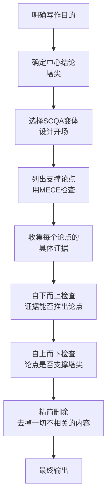
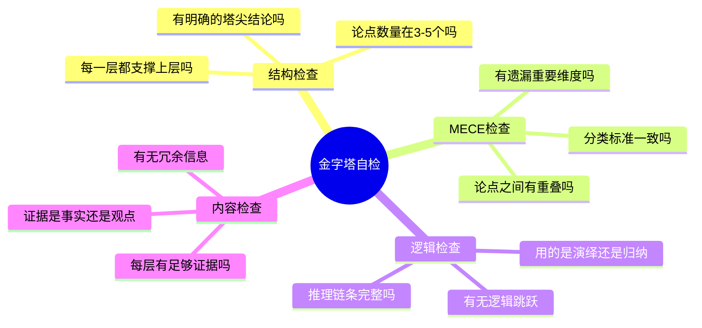

# ◇ 04 核心内容C：金字塔原理的综合应用与跨书连接 ◆

本节将金字塔原理整合为可操作的综合框架，并建立与系列中其他书籍的连接。

---

## 01 金字塔写作完整流程

---

## 02 金字塔原理在日常写作中的应用

### ◆ 邮件写作

普通邮件："张三你好，关于昨天的会议，我整理了以下信息。首先..."

金字塔邮件："张三你好，建议采用方案B推进项目。理由有三：第一，成本最低（节省30万）；第二，周期最短（2个月 vs 4个月）；第三，风险可控（有备用方案）。详细分析见附件，请确认。"

### ◆ 会议纪要

普通纪要：按发言顺序记录每个人说了什么。

金字塔纪要：先写决议和行动项（塔尖），再写讨论要点（支撑论点），最后写背景信息（底层证据）。

### ◆ 周报/月报

金字塔周报结构：本周核心成果（塔尖）→各模块进展（支撑论点）→下周计划（行动项）→风险与问题（补充信息）。

---

## 03 与系列其他书籍的连接

### ◆ 与《高效演讲》的连接

金字塔原理解决"说什么"，高效演讲解决"怎么说"。两者是互补关系。

用金字塔原理构建内容框架，用高效演讲的技巧把框架内容生动地传递给观众。

### ◆ 与《OKR工作法》的连接

OKR的设定本身就遵循金字塔结构：O（目标）是塔尖，KRs（关键结果）是支撑论点。

写OKR时，先用SCQA说明为什么设定这个目标，再用金字塔结构组织KRs。

### ◆ 与《远见》的连接

在职业规划的每个阶段，都需要用金字塔原理来梳理：我想成为什么样的人（塔尖）？需要积累哪些能力、经验和关系（支撑论点）？

### ◆ 与《逆商》的连接

面对逆境时，用金字塔原理快速分析问题：核心问题是什么（塔尖）？有哪些可控因素（支撑论点）？可以采取哪些具体行动（底层证据）？

---

## 04 金字塔自检清单

每次写完重要文档后，用以下清单自检：

---

## 05 实战练习建议

选择一个你本周需要写的文档（邮件、报告、方案），严格按照以下步骤操作：

第一步：用一句话写下你想让对方采取的行动或做出的决定。

第二步：列出支撑这句话的三个理由，用MECE检查。

第三步：用SCQA写第一段。

第四步：检查逻辑链条，删除一切不必要的内容。

第五步：请同事在30秒内阅读，问他能否抓住核心信息。如果不能，回到第一步。

---

下一节：◆ 05 结尾与30天挑战计划
