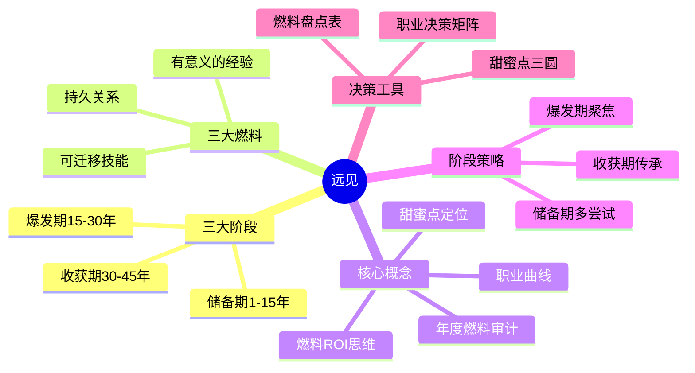
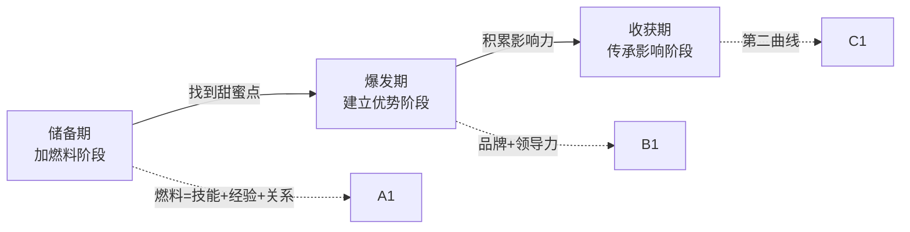
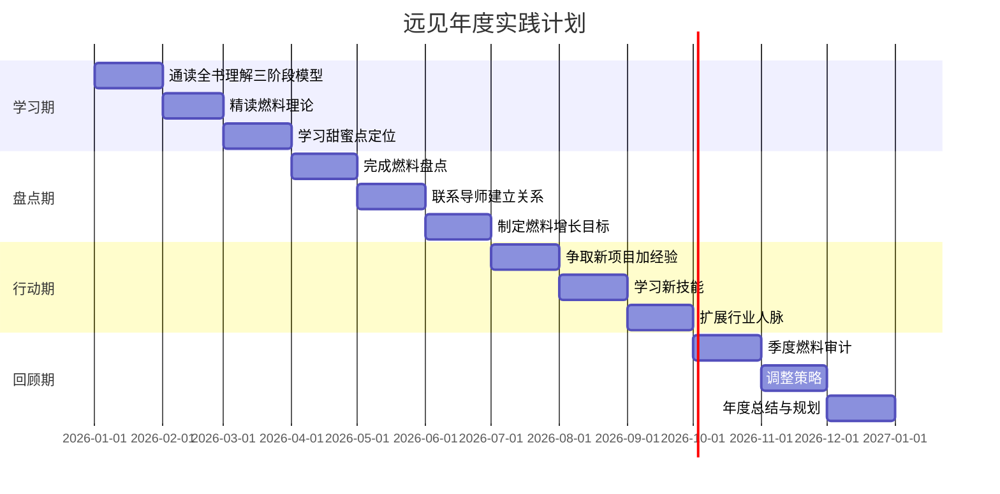

# ◇ 系列视觉指南：《远见》阅读地图 ◆

本节提供《远见》的完整视觉化学习路径，帮助读者快速把握全书脉络，并与其他书籍建立连接。

---

## 01 全书知识结构思维导图



---

## 02 职业生涯成长路径



### ◆ 各阶段学习重点

| 阶段 | 学习重点 | 核心练习 | 时间投入 |
|------|---------|---------|---------|
| 储备期 | 广泛学习、寻找导师 | 每年尝试一个新领域 | 持续15年 |
| 爆发期 | 聚焦甜蜜点、建立品牌 | 打造个人专业IP | 持续15年 |
| 收获期 | 发挥影响、培养后辈 | 建立传承体系 | 持续15年 |

---

## 03 与系列其他书籍的关系图

```mermaid
graph TD
    A["远见<br/>职业规划"] -->|"规划框架"| B["金字塔原理<br/>结构化思考"]
    A -->|"个人OKR"| C["OKR工作法<br/>目标管理"]
    A -->|"面对挫折"| D["逆商<br/>应对逆境"]
    A -->|"传递价值"| E["高效演讲<br/>沟通表达"]
    B -->|"规划用金字塔"| A
    C -->|"燃料目标=OKR"| A
    D --><"职业低谷需要AQ"> A
    E -->|"职业品牌需要演讲"| A
    C -->|"OKR用金字塔"| B
    E --><"演讲克服紧张"> D
```

---

## 04 12个月阅读与实践时间线



---

## 05 阅读顺序建议

### ◆ 推荐阅读流程

**第一遍：快速通读（2-3天）**——重点关注"三阶段模型"和"三桶燃料"这两个核心概念。建立全局框架感。

**第二遍：精读你的阶段章节（1周）**——根据你当前所处的职业阶段，精读对应章节。做燃料盘点，定位甜蜜点。

**第三遍：持续应用（长期）**——每年做一次燃料审计，根据审计结果调整下一年的职业策略。

### ◆ 与系列其他书的阅读顺序

1. 先读《远见》建立职业规划的长期框架（这是你的"战略地图"）
2. 用《OKR工作法》把长期规划分解为年度和季度目标
3. 用《金字塔原理》让你的规划文档和汇报逻辑严密
4. 用《高效演讲》把你的职业品牌和价值主张传递出去
5. 遇到职业挫折时用《逆商》的心态快速恢复和成长

---

◇ 关注"人类文明经典阅读计划"，每月共读一本好书 ◆
