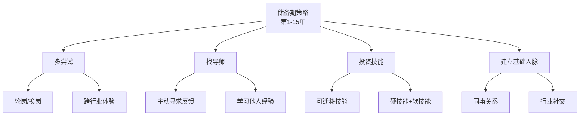

# ◇ 02 核心内容A：职业生涯三阶段详解 ◆

本节深入讲解《远见》的核心框架——职业生涯三大阶段模型。理解你所在的阶段，是做出正确职业决策的第一步。

---

## 01 第一阶段：储备期（第1-15年）

这是职业生涯的"加燃料"阶段。核心目标不是赚钱，而是学习。

### ◆ 关键策略

**多尝试，少固化**——不要急于选定一条路走到底。尝试不同的岗位、行业、城市。每一次尝试都是在为你的燃料桶添加不同类型的燃料。

**寻找好导师**——找到一个愿意教你、给你反馈、帮你成长的导师。好导师比好公司更重要。

**接受不完美**——这个阶段的工作不会完美。重要的是每一段经历都能让你学到东西。如果一份工作让你停止了成长，就该考虑离开了。

**投资技能>投资薪水**——两个offer之间，优先选能学到更多技能的那个，而不是薪水更高的那个。30岁之前少赚10万，可能在30岁之后多赚100万。

### ◆ 常见错误

在这个阶段，很多人犯的最大错误是：过早地追求稳定。一份让你"舒服"但"不成长"的工作，是储备期最大的燃料泄漏。

---

## 02 第二阶段：爆发期（第15-30年）

这是职业生涯的"聚焦"阶段。核心目标是建立专业优势和不可替代性。

### ◆ 关键策略

**找到你的甜蜜点**——甜蜜点是三个圆的交集：你擅长的、你热爱的、市场需要的。找到它，然后all in。

**建立品牌**——让你所在领域的想到某件事就想到你。可能是"最懂用户增长的人"，也可能是"最会带跨文化团队的人"。

**学会管理**——即使你不走管理路线，也需要学会影响他人。领导力是这个阶段最重要的可迁移技能。

**持续加燃料**——不要以为进入爆发期就可以停止学习了。这个阶段的学习应该更有针对性，围绕你的甜蜜点进行。

---

## 03 第三阶段：收获期（第30-45年）

这是职业生涯的"影响力"阶段。核心目标是发挥更大的影响力和传承经验。

### ◆ 关键策略

**从执行者到赋能者**——你的价值不再是你自己能做什么，而是你能帮助多少人做到什么。

**传递火炬**——找到你的接班人，培养他们，让他们超越你。

**探索新可能**——这个阶段是探索第二曲线的好时机。创业、顾问、公益、教学——你有了足够的燃料去尝试更有意义的事。

---

## 04 场景示例

**场景一：28岁的你面临两个offer**

A公司：薪水高20%，但工作内容重复、学习空间有限。
B公司：薪水低一些，但能接触核心项目、有优秀导师。

储备期策略：选B。多赚的20%在10年后可能只是一次调薪的幅度，但B公司给你的燃料可能影响整个职业生涯。

**场景二：35岁的你觉得到了瓶颈**

诊断：你可能已经从储备期过渡到爆发期，但还在用储备期的策略——不断尝试、不断学习。这时候需要做减法，聚焦甜蜜点。

---

## 05 行动清单

□ 确定你目前处于职业生涯的哪个阶段

□ 列出你的三大燃料桶（技能/经验/人脉），各写5项

□ 评估哪一桶最薄弱，制定加燃料计划

□ 如果你是储备期，写下今年要尝试的3个新事物

□ 如果你是爆发期，用一句话定义你的甜蜜点

□ 如果你是收获期，列出3个可以传递影响力的方式

□ 找一位导师（储备期）或成为导师（收获期）

---

下一节：◆ 03 核心内容B——职场燃料理论与职业曲线
