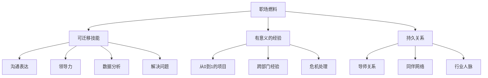
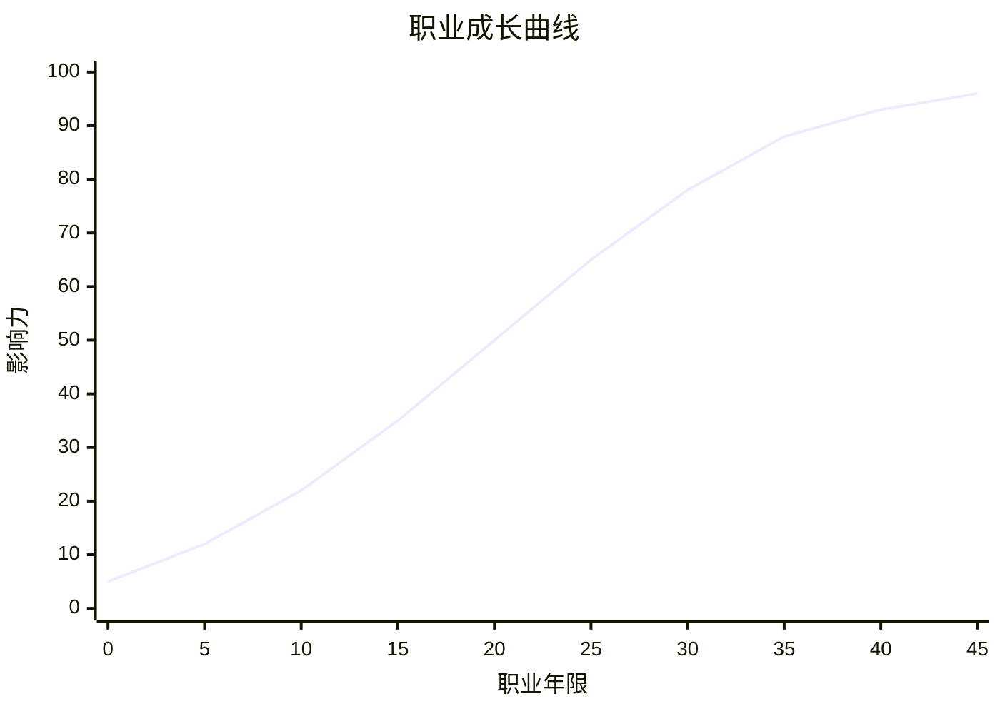

# ◇ 03 核心内容B：职场燃料理论与职业曲线 ◆

职场燃料是决定你能跑多远的能量来源。职业曲线思维帮你理解不同阶段的增长模式。

---

## 01 三大职场燃料详解

### ● 燃料一：可迁移技能

可迁移技能是那些"换一家公司、换一个行业依然有用"的能力。它们是你职业生涯的硬通货。

**硬技能类**：数据分析、编程、财务管理、项目管理、市场营销。这些技能有明确的学习路径和评估标准。

**软技能类**：沟通表达、领导力、解决问题、批判性思维、情商。这些技能更难学习，但价值更高。

最强大的可迁移技能是那些结合了硬技能和软技能的"复合技能"。比如"用数据讲故事的能力"——它既需要数据分析（硬技能），也需要沟通表达（软技能）。

### ● 燃料二：有意义的经验

有意义的经验是那些能推动你成长的关键经历。它们通常伴随着挑战和不适。

**关键经验类型**：
- 领导一个项目从0到1
- 跨部门或跨国家的轮岗
- 处理一次危机事件
- 带团队完成不可能的任务
- 从失败中站起来

经验的价值不在于"做了多少年"，而在于"经历的质量和多样性"。在同一个岗位做十年，和在不同岗位各做两年，积累的燃料量完全不同。

### ● 燃料三：持久关系

持久关系是那些能在你整个职业生涯中互相支持的人脉。他们不是微信里的三千个好友，而是当你需要建议、推荐或合作时真正能帮上忙的人。

**关系类型**：
- 导师（比你资深的人，给你指导）
- 同伴（与你同频的人，互相激励）
- 后辈（比你年轻的人，给你新鲜视角）
- 客户和合作伙伴（外部关系，拓展视野）

---

## 02 职业曲线思维

### ◆ 非线性增长

职业成长不是线性的。在某个节点之前，你可能感觉进展缓慢。但当你积累了足够的燃料，增长会突然加速。这就是"职业曲线"。

### ◆ 燃料积累的关键节点

每个阶段都有一个"燃料积累的关键决策点"。在这些节点上做出的选择，会对后面的职业轨迹产生深远影响。

储备期的关键决策点：选择第一份工作、选择第一个导师、选择是否跳槽。
爆发期的关键决策点：选择是否走管理路线、选择是否创业、选择是否换行业。
收获期的关键决策点：选择是否退休、选择第二曲线、选择传承方式。

---

## 03 对比表：不同阶段的策略差异

| 维度 | 储备期(1-15年) | 爆发期(15-30年) | 收获期(30-45年) |
|------|---------------|----------------|----------------|
| 核心目标 | 学习与探索 | 建立优势 | 影响力与传承 |
| 决策标准 | 燃料最大化 | 甜蜜点聚焦 | 意义最大化 |
| 风险态度 | 拥抱风险 | 管理风险 | 传递经验 |
| 学习方式 | 广泛尝试 | 深度专精 | 教学相长 |
| 关系建设 | 建立基础人脉 | 深化关键关系 | 扩展影响力网络 |
| 收入策略 | 投资自己>薪水 | 薪水+股权 | 多元化收入 |
| 时间分配 | 70%学习30%产出 | 50%执行50%管理 | 30%执行70%赋能 |

---

## 04 常见陷阱

### ◆ 陷阱一：用短期指标衡量长期价值

只看薪水和职位头衔，不看燃料积累。高薪但无成长的工作，本质上是在消耗你的长期价值。

### ◆ 陷阱二：在储备期过早固化

25岁就决定"我这辈子就做这个了"。职业生涯有45年，过早固化等于关闭了所有可能性。

### ◆ 陷阱三：在爆发期持续分散精力

到了该聚焦的时候还在"什么都学、什么都做"。没有聚焦就没有深度，没有深度就没有不可替代性。

### ◆ 陷阱四：忽视关系燃料

只关注技能提升，不花时间经营关系。但到了职业中后期，关系往往比技能更能决定你的高度。

---

下一节：◆ 04 核心内容C——综合框架与跨书连接
